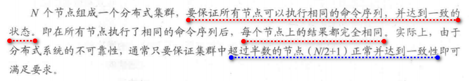

## 一、引出
 因为分布式系统的可靠性原理(起始就是不可靠的事实)，引出了分布式系统中影响深远的一个重要原理——一致性原理。分布式集群的一致性是分布式系统里“无法绕开的一块巨石”，而目前解决此问题的几个一致性算法也都非常复杂(比如 **Paxos\Raft\ZAB**)

---
## 二、原理描述
 原理+真实场景

这里其实是业界的共识，使用一半成功的标准评判消息的可靠性！

也其实是在容错与性能之间的权衡吧~