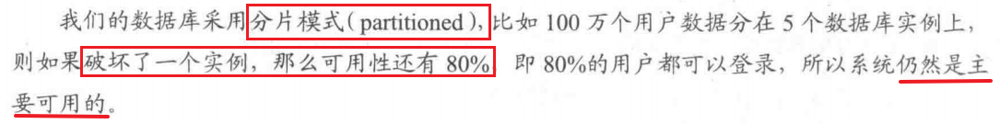

# BASE 理论——牺牲数据的一致性来满足系统的高可用性

# 一、引出
 从前面的分析中我们知道:在分布式(数据库分片或分库存在多个实例上)系统下，CAP理论并不适合数据库事务。如果要强制支持，那么就是要付出高额的性能消耗。

---
# 二、定义
 BASE 的全称是 **Basically Available , Soft-state, Eventually Consistent**，即**系统基本可用、软状态、(数据)最终一致性**，我们看到，相对于CAP来说，它大大降低了我们对系统的要求。

----
# 三、CS架构的三种状态
## 1.系统基本可用
  

## 2.软状态
  在基于 Client-Server 模式的系统中，Server是有状态的(stateful)还是无状态的(stateless)(也就是有保存、无保存)，这是一个很重要的设计思路，也在根本上决定了一个分布式系统是否具备良好的水平扩展、负载均衡、故障恢复等高级特性。然而，除了stateless和 stateful，还存在另外一种方式**Soft state**，它最早来源于计算机网络中的协议设计，在分布式系统中的含义如下:Server 端承诺会维护 Client的状态数据，但是“**仅仅维持一小段时间**”，过了这个时间段Server就会将这些状态信息丢弃，恢复正常行为状态。

## 3.CS架构的三种状态
基于对Client的当前操作状态在sever保存对比！

### (1)有状态
#### 网络游戏服务器：
在大型多人在线角色扮演游戏（MMORPG）中，服务器需要记录每个玩家的角色信息，包括角色等级、装备、经验值、所在位置等状态。
#### 电子邮箱服务器：
服务器会维护用户的邮箱状态，包括已发送邮件、收件箱邮件、已删除邮件等。用户发送邮件后，服务器会记录该邮件已发送的状态
#### 银行账户管理系统：
银行服务器需要记住每个客户的账户状态，如账户余额、交易记录、信用额度等。当客户进行存款、取款或转账等操作时，服务器会更新账户的相应状态信息。

### (2)软状态
### 1.推荐系统——用户推荐兴趣仅仅维持一段时间！(用户兴趣可能会变~)

#### (1)在线广告投放系统：
广告服务器会维护用户的浏览行为状态数据，以实现个性化广告投放。例如，服务器会记录用户在一段时间内浏览过的商品类别、点击过的广告等信息。但这些状态数据不会长期保存，只是在一定时间窗口（如一周）内有效。过了这个时间段，服务器会丢弃这些状态信息，恢复正常的广告投放逻辑，不再基于这些过期的用户行为数据进行个性化推荐。

#### (2)内容推荐系统：
以视频平台为例，服务器会根据用户近期的观看历史、收藏、点赞等行为来推荐相关视频内容。服务器会保存用户的这些行为数据作为软状态，在一段时间（如一个月）内，根据这些状态为用户生成个性化的视频推荐列表。但超过这个时间后，**服务器会逐渐淡化这些历史行为数据的影响**，重新**根据用户的新行为来更新推荐**，原有的状态信息会被丢弃。

### 2.定时结束——买票系统
下单了不支付，隔了30minutes会取消

----
### (3)无状态
#### 公共新闻资讯网站：
用户访问新闻网站获取新闻内容时，服务器每次接收到用户的请求**都是独立处理**的。服务器不需要记住用户之前访问过哪些新闻页面，也不依赖于用户之前的操作状态。

## 4.软状态定义
   Soft state，它最早来源于计算机网络中的协议设计，在分布式系统中的含义如下:Server 端承诺会维护 Client的状态数据，但是“仅仅维持一小段时间”，过了这个时间段Server就会将这些状态信息丢弃，恢复正常行为状态。

## 5.数据最终一致性
  从上面的分析解释来看，BASE准则的思想其实就是**牺牲数据的一致性来满足系统的高可用性**，系统中一部分数据不可用或者不一致时，仍需要**保持系统整体“主要可用”**。

# 四、BASE举例

## 1.淘宝、天猫等电商
商品详情页的展示也会利用软状态。例如，用户浏览商品时，系统会缓存一些商品的相关信息（如描述、图片等），这些缓存数据在一段时间内有效（处于软状态）。**当缓存过期后，系统会重新获取最新的商品信息**，这样既能减轻数据库的压力，又能保证在一定时间内页面的正常展示，实现了系统的基本可用。

## 2.社交平台——微博的点赞转发等~~
在微博上，用户发布的微博、点赞、评论等操作量巨大。为了保证系统的可用性，**平台采用了 BASE 理论**。当用户发布一条微博后，可能并不是所有用户都能立即看到这条新微博，因为系统会**优先保证新微博的发布操作能够成功记录**（**基本可用**），然后通过异步的方式将新微博推送给其他用户。在这个过程中，**存在数据不一致的时间段**，但最终所有用户都能看到最新的微博内容，**实现了最终一致性**。

## 3.Redis
Redis 是一个高性能的内存数据库，常用于缓存场景。在使用 Redis 作为缓存时，通常会采用 BASE 理论。例如，当应用程序从数据库中读取数据并存储到 Redis 缓存中后，缓存数据会在一段时间内有效（软状态）。在这段时间内，**如果数据库中的数据发生了变化，缓存中的数据可能是不一致的**。但是，应用程序会优先从 Redis 中读取数据以提高性能，当缓存过期后，再从数据库中读取最新数据并更新缓存，从而实现了**基本可用和最终一致性**。

Redis 还支持主从复制，在主从复制过程中，**从节点的数据会存在一定的延迟**，即主从节点的数据在短时间内是不一致的。但通过异步复制，最终从节点的数据会与主节点保持一致，这也是 BASE 理论在 Redis 中的应用体现。