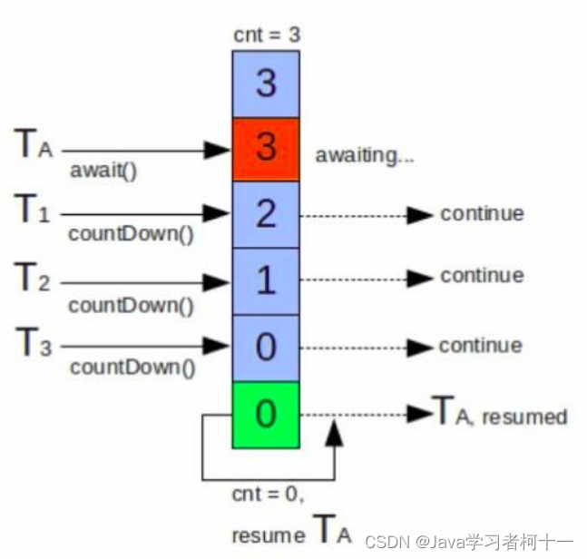

## 一、CountDownLatch——本质：允许一个或多个线程等待，直到其他线程完成操作集



### 1.等待一群线程完成任务
1. CountDownLatch（闭锁）是一个**同步协助类**，**允许一个或多个线程等待，直到其他线程完成操作集**。 

### 2.计数值初始化
2. CountDownLatch 使用**给定的计数值（count）初始化**。 

### 3.await方法阻塞
3. await方法会阻塞**直到当前的计数值被countDown方法的调用达到0**，**count为0之后所有等待的线程都会被释放**，并且随后 **对await方法的调用都会立即返回**。 

### 4.一次性现象
4. 这是一个**一次性现象** —— **count不会被重置**。如果你需要一个重置count的版本，那么请考虑使用CyclicBarrier。


----

# 二、常用方法-await（）

```java
 // 调用 await() 方法的线程会被挂起，它会等待直到 count 值为 0 才继续执行
public void await() throws InterruptedException { };  
// 和 await() 类似，若等待 timeout 时长后，count 值还是没有变为 0，不再等待，继续执行
public boolean await(long timeout, TimeUnit unit) throws InterruptedException { };  
// 会将 count 减 1，直至为 0

```


# 三、代码实例

## 一等多=>任务汇总
```java
package com.thread.CountDownLatch;

import java.util.concurrent.CountDownLatch;

public class testWait1 {

    public static void main(String[] args) throws InterruptedException {
        CountDownLatch countDownLatch = new CountDownLatch(10);
        for ( int i = 0; i < 10; i++) {
            new Thread(()->{
                System.out.println(Thread.currentThread().getName()+"running~");
                countDownLatch.countDown();
            }).start();
        }
        countDownLatch.await();//主线程会一直执行，直至count==0，也就是前面的线程执行完了再说！常用于汇总工作~~
        
        System.out.println("All threads executes over~ this is main thread~");
    }
}
```


## 多等一=>模拟并发
```java
package com.thread.CountDownLatch;

import java.util.concurrent.CountDownLatch;

// 让多个线程等待！
public class testWaitMany {
    public static void main(String[] args) throws InterruptedException {
        CountDownLatch countDownLatch = new CountDownLatch(1);
        for (int i = 0; i < 10; i++) {
            new Thread(()->{
                try {
                    countDownLatch.await();//这10个线程会等待主线程执行，将计数器递减为0时才开始一起执行(类似于裁判发枪指令~)
                    System.out.println(Thread.currentThread().getName()+" running~~");
                } catch (InterruptedException e) {
                    e.printStackTrace();
                }
                
            }).start();
        }
        Thread.sleep(1000);
        System.out.println(Thread.currentThread().getName()+" running~~");
        countDownLatch.countDown();//发枪了，只不过在这时，主线程的任务已经执行完成了！
    }
}
```