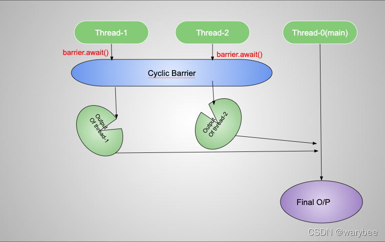

## 一、CyclicBarrier简介 =>本质：分总分的CountDownLatch~=

## 核心：所有线程数量一起到达栅栏处在一起执行，所以只要有一个没到达，就会一直阻塞！

CyclicBarrier是一个同步器，允许**一组线程相互之间等待**，直到**到达某个公共屏障点** (common barrier point)，再继续执行。因为CyclicBarrier 的计数器是可以**循环利用**的，所以称它为循环（Cyclic） 的 Barrier。 

CyclicBarrier常用于多线程计算数据，当所有线程都完成执行后，在CyclicBarrier回调线程中合并计算。




## 二、真实使用：=>
默认的构造方法：CyclicBarrier（int parties）

其参数表示屏障（barrier ）拦截的线程数量，**每个线程调用await方法**告诉CyclicBarrier**我已经到达了屏障**，**然后当前线程被阻塞**。


### 验证只有等到10个线程到达栅栏了，才能继续下一步操作！
所以调用await()的线程数一定要不少于栅栏数的！

```java
package com.thread.CyclicBarrier;

import java.util.concurrent.BrokenBarrierException;
import java.util.concurrent.CountDownLatch;
import java.util.concurrent.CyclicBarrier;

public class testCyclicBarrier {
    public static void main(String[] args) throws InterruptedException, BrokenBarrierException {
        CyclicBarrier cyclicBarrier = new CyclicBarrier(10);
        //若改成11，则程序永远阻塞，因为没有11个线程会到达栅栏，只有10个！
        for (int i = 0; i < 9; i++) {
            new Thread(() -> {
                try {
                    Thread.sleep(1000);
                    System.out.println(Thread.currentThread().getName() + "running~");
                    cyclicBarrier.await();
                } catch (InterruptedException | BrokenBarrierException e) {
                    // TODO Auto-generated catch block
                    e.printStackTrace();
                }
            }).start();
        }
        cyclicBarrier.await();
        Thread.sleep(100);
        System.out.println("must wait all thread together, then next execute this task!");
    }
}
```


### 分组栅栏，三个三个一组放行
```java

public class testCyclicBarrier {
    public static void main(String[] args) throws InterruptedException, BrokenBarrierException {
        CyclicBarrier cyclicBarrier = new CyclicBarrier(3);//若改成11，则程序永远阻塞，因为没有11个线程会到达栅栏，只有10个！
        for (int i = 0; i < 9; i++) {
            new Thread(() -> {
                try {
                    // Thread.sleep(1000);
                    System.out.println(Thread.currentThread().getName() + "running~");
                        cyclicBarrier.await();
                } catch (InterruptedException | BrokenBarrierException e) {
                    e.printStackTrace();
                }
            }).start();
            if((i+1)%3==0){
                Thread.sleep(1000);
                System.out.println("第"+i/3+"组的3个线程达到，放行~~");
            }
        }   
        Thread.sleep(100);
        System.out.println("must wait all thread together, then next execute this task!");
    }
}

```

---

## 三、cyclicBarrier与CountDownLatch区别

### 1.CyclicBarrier:分总分+循环

就像一个团队成员们**约定在某个地点集合**，每次**集合后大家一起行动**，然后还可以**再次在其他地点集合**；


### 2.CountDownLatch：分总+一次性

而 CountDownLatch 更像是**团队成员们各自完成自己的任务**，当**所有人都完成任务后**，团队整体才能进行下一步行动，且这个过程是**一次性**的，不能重复利用这个机制进行下一轮的任务完成等待。