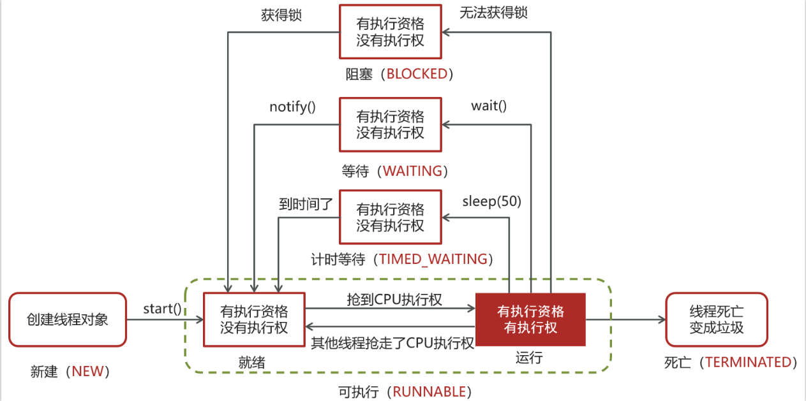

# 一、线程的6中转化方式

本质：一切的一切都是与底层线程的关联程度！

## 1.新建
 ### 进入条件
  当一个线程对象被创建，但还未调用 start 方法时处于新建状态
 此时**未与操作系统底层线程关联**

## 2.可运行
 ### 进入条件
  调用了 **start 方法，就会由新建进入可运行**，此时**与底层线程关联**，由操作系统调度执行。
 **可运行不一定执行，只是有执行资格，没有执行权**，执行**还需要操作系统调度**。

## 3.终止
 ### 进入条件
  线程内代码已经执行完毕，由可运行进入终结
 此时**会取消与底层线程关联**

## 4.阻塞——阻塞队列
 ### 进入条件
  当获取锁失败后，由**可运行进入 Monitor 的阻塞队列阻塞**，此时**不占用 cpu 时间**

 ### 唤醒条件
  **当持锁线程释放锁时**，会按照一定规则唤醒阻塞队列中的阻塞线程(线程之间争抢呢！)，唤醒后的线程进入可运行状态（）

## 5.等待——等待队列
### 进入条件
  当获取锁成功后，但**由于条件不满足**(比如转账时发现钱不够了，就需要其他线程来转给我，我在转给别人，此时就会由其他线程来唤醒我！)，调用了 **wait()** （没有参数）方法，此时从可运行状态释放锁**进入 Monitor 等待集合**等待，同样不占用 cpu 时间

###  唤醒条件
  当其它持锁线程调用 notify() 或 notifyAll() 方法，会按照一定规则唤醒等待集合中的等待线程，恢复为可运行状态

## 6.计时等待
 ### 进入条件
  wait(long time)(对象锁的)
   当获取锁成功后，但由于条件不满足，调用了 wait(long) 方法（有参数），此时从可运行状态释放锁进入 Monitor 等待集合进行有时限等待，同样不占用 cpu 时间

  sleep(long time)
   还有一种情况是调用 sleep(long) 方法也会从可运行状态进入有时限等待状态，但与 Monitor 无关

 ### 唤醒条件
  wait(long time)
   当**其它持锁线程调用 notify()**（唤醒随机一个） 或 notifyAll()（唤醒全部） 方法，会按照一定规则唤醒等待集合中的有时限等待线程，恢复为可运行状态，并重新去竞争锁
   如果**等待超时**，恢复为可运行状态，并重新去竞争锁

  sleep(long time)
   不需要主动唤醒，**超时时间到自然恢复为可运行状态**