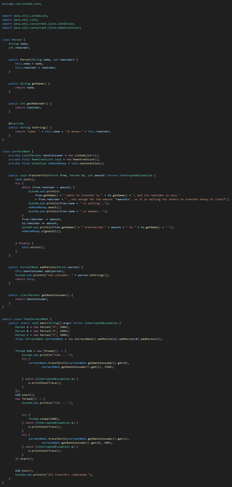

# 本质：对象锁，要保证所有得锁放锁在一个对象里面进行！不然出错！


## 正确版本：
```java
package com.thread.Lock;

import java.util.LinkedList;
import java.util.List;
import java.util.concurrent.locks.Condition;
import java.util.concurrent.locks.ReentrantLock;

class Person {
    String name;
    int reminder;

    public Person(String name, int reminder) {
        this.name = name;
        this.reminder = reminder;
    }

    public String getName() {
        return name;
    }

    public int getReminder() {
        return reminder;
    }

    @Override
    public String toString() {
        return "name: " + this.name + "\t money:" + this.reminder;
    }
}

class CorrectBank {
    // 正确版本，注意只维护一个银行对象，所有客户用这一个锁！这样就保证所有对象共用一把锁了！本质是Lock是对象锁
    private List<Person> bankConsumer = new LinkedList<>();
    private final ReentrantLock lock = new ReentrantLock();
    private final Condition noMoreMoney = lock.newCondition();

    public void transfersTo(Person from, Person to, int amount) throws InterruptedException {
        lock.lock();
        try {
            while (from.reminder < amount) {
                System.out.println(
                    from.getName() + " wants to transfer to " + to.getName() + ", but its reminder is only "
                    + from.reminder + " , not enough for the amount "+amount+", so it is waiting for others to transfer money to itself");
                System.out.println(from.name + " is waiting...");
                noMoreMoney.await();
                System.out.println(from.name + " is awaken...");
            }
            from.reminder -= amount;
            to.reminder += amount;
            System.out.println(from.getName() + " transferred " + amount + " to " + to.getName() + ".");
            noMoreMoney.signalAll();

        } finally {
            lock.unlock();
        }
    }

    public CorrectBank addPerson(Person person) {
        this.bankConsumer.add(person);
        System.out.println("Add consumer: " + person.toString());
        return this;
    }

    public List<Person> getBankConsumer() {
        return bankConsumer;
    }
}

public class TestCorrectBank {
    public static void main(String[] args) throws InterruptedException {
        Person A = new Person("A", 1000);
        Person B = new Person("B", 2000);
        Person C = new Person("C", 3000);
        final CorrectBank correctBank = new CorrectBank().addPerson(A).addPerson(B).addPerson(C);

        Thread A2B = new Thread(() -> {
            System.out.println("A2B.....");
            try {
                correctBank.transfersTo(correctBank.getBankConsumer().get(0),
                        correctBank.getBankConsumer().get(1), 1500);

            } catch (InterruptedException e) {
                e.printStackTrace();
            }
        });
        A2B.start();
        new Thread(() -> {
            System.out.println("C2A.....");

            try {
                Thread.sleep(1000);
            } catch (InterruptedException e) {
                e.printStackTrace();
            }
            try {
                correctBank.transfersTo(correctBank.getBankConsumer().get(2),
                        correctBank.getBankConsumer().get(0), 600);
            } catch (InterruptedException e) {
                e.printStackTrace();
            }
        }).start();

        A2B.join();
        System.out.println("All transfers completed.");
    }
}
```

## 错误版本：
```java
package com.thread.Lock;

import java.util.concurrent.locks.Condition;
import java.util.concurrent.locks.ReentrantLock;
// 错误版本：因为这里都不是一个对象，就更别说锁互用了
class Bank {
    int remainer;// 剩余的钱
    String name;// 开户人

    private final ReentrantLock lock = new ReentrantLock();
    private Condition bankRemainerIsless = lock.newCondition();// 创建一个余额不足的条件变量

    public Bank(int remainer, String name) {
        this.remainer = remainer;
        this.name = name;
    }

    public int getRemainer() {
        return remainer;
    }

    public String getName() {
        return name;
    }

    // 给别人转账
    public void transferToOther(Bank b, int amount) throws InterruptedException {
        lock.lock();
        try {
            while (this.remainer < amount) {// 余额不足，A暂停转账，等别人转给他,一直查询，防止虚假唤醒！
                System.out.println(
                        this.name + " wants to transfer " + amount + " to " + b.getName() + " ,but " + this.name
                                + " 's remainer is " + this.remainer + " ,not enough, waiting other transfer to it...");
                System.out.println(this.name + " is waiting...");
                bankRemainerIsless.await();// ...暂停。。。。等待别人给他转账了才能继续！
                System.out.println(this.name + " is awakened...");
            }

            this.remainer -= amount;// 转账顺利，A减少钱
            b.remainer += amount;// 转账顺利，B增加钱
            System.out.println(this.name + " has transfers " + amount + "￥ to " + b.name + ", Now " + b.name
                    + " 's amount is " + b.remainer);
            bankRemainerIsless.signalAll();//用于唤醒在该 Condition 上等待的所有线程。
            System.out.println(this.name+" called the signaiAll()....");

        } catch (InterruptedException e) {// 对 await() 方法抛出的 InterruptedException 进行单独处理，并恢复中断状态。
            System.out.println(this.name + " is interrupted during waiting.");
            Thread.currentThread().interrupt();
        } finally {
            lock.unlock();
        }
    }
}

public class testBankCondition3 {
    public static void main(String[] args) throws InterruptedException {
        System.out.println(Thread.currentThread().getName()+" is running--Main\n");
    // 错误版本：因为这里都不是一个对象，就更别说锁互用了

        Bank A = new Bank(1000, "A");
        Bank B = new Bank(2000, "B");
        // 创建转账线程
        Thread A2B = new Thread(() -> {
        System.out.println(Thread.currentThread().getName()+" is running--A2B");
            try {
                A.transferToOther(B, 1500);
            } catch (InterruptedException e) {
                e.printStackTrace();
            }
        });

        A2B.start();
        Bank C = new Bank(1000, "C");
        Thread C2A = new Thread(() -> {
        System.out.println(Thread.currentThread().getName()+" is running--C2A");

            try {
                Thread.sleep(1000);
            } catch (InterruptedException e) {
                e.printStackTrace();
            }

            try {
                C.transferToOther(A, 600);
            } catch (InterruptedException e) {
                e.printStackTrace();
            }

            System.out.println();
        });
        C2A.start();

        // 确保主线程是必须等到A2B完成时才退出！
        try {
            A2B.join();
        } catch (InterruptedException e) {
            e.printStackTrace();
        }
    }
}


```