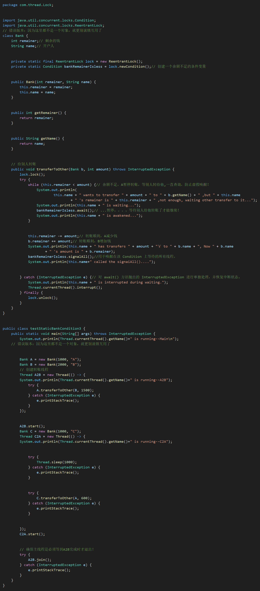

# 按理说，类级别的应该会成功，因为是针对一个类，为什么失败了？



```java
package com.thread.Lock;

import java.util.concurrent.locks.Condition;
import java.util.concurrent.locks.ReentrantLock;
// 错误版本：因为这里都不是一个对象，就更别说锁互用了
class Bank {
    int remainer;// 剩余的钱
    String name;// 开户人

    private static final ReentrantLock lock = new ReentrantLock();
    private static Condition bankRemainerIsless = lock.newCondition();// 创建一个余额不足的条件变量

    public Bank(int remainer, String name) {
        this.remainer = remainer;
        this.name = name;
    }

    public int getRemainer() {
        return remainer;
    }

    public String getName() {
        return name;
    }

    // 给别人转账
    public void transferToOther(Bank b, int amount) throws InterruptedException {
        lock.lock();
        try {
            while (this.remainer < amount) {// 余额不足，A暂停转账，等别人转给他,一直查询，防止虚假唤醒！
                System.out.println(
                        this.name + " wants to transfer " + amount + " to " + b.getName() + " ,but " + this.name
                                + " 's remainer is " + this.remainer + " ,not enough, waiting other transfer to it...");
                System.out.println(this.name + " is waiting...");
                bankRemainerIsless.await();// ...暂停。。。。等待别人给他转账了才能继续！
                System.out.println(this.name + " is awakened...");
            }

            this.remainer -= amount;// 转账顺利，A减少钱
            b.remainer += amount;// 转账顺利，B增加钱
            System.out.println(this.name + " has transfers " + amount + "￥ to " + b.name + ", Now " + b.name
                    + " 's amount is " + b.remainer);
            bankRemainerIsless.signalAll();//用于唤醒在该 Condition 上等待的所有线程。
            System.out.println(this.name+" called the signaiAll()....");

        } catch (InterruptedException e) {// 对 await() 方法抛出的 InterruptedException 进行单独处理，并恢复中断状态。
            System.out.println(this.name + " is interrupted during waiting.");
            Thread.currentThread().interrupt();
        } finally {
            lock.unlock();
        }
    }
}

public class testStaticBankCondition3 {
    public static void main(String[] args) throws InterruptedException {
        System.out.println(Thread.currentThread().getName()+" is running--Main\n");
    // 错误版本：因为这里都不是一个对象，就更别说锁互用了

        Bank A = new Bank(1000, "A");
        Bank B = new Bank(2000, "B");
        // 创建转账线程
        Thread A2B = new Thread(() -> {
        System.out.println(Thread.currentThread().getName()+" is running--A2B");
            try {
                A.transferToOther(B, 1500);
            } catch (InterruptedException e) {
                e.printStackTrace();
            }
        });

        A2B.start();
        Bank C = new Bank(1000, "C");
        Thread C2A = new Thread(() -> {
        System.out.println(Thread.currentThread().getName()+" is running--C2A");

            try {
                Thread.sleep(1000);
            } catch (InterruptedException e) {
                e.printStackTrace();
            }

            try {
                C.transferToOther(A, 600);
            } catch (InterruptedException e) {
                e.printStackTrace();
            }

        });
        C2A.start();

        // 确保主线程是必须等到A2B完成时才退出！
        try {
            A2B.join();
        } catch (InterruptedException e) {
            e.printStackTrace();
        }
    }
}

```