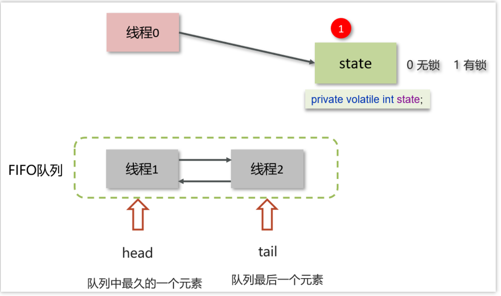

# 底层原理——AQS——构建锁和同步器的框架

## 一、综述：
ReentrantLock 内部使用了 **AbstractQueuedSynchronizer（AQS）**来实现锁的核心逻辑。
AQS 是一个用于**构建锁和同步器的框架**，它使用一个**整型的 state 变量**来表示锁的状态，以及一个**双向链表**来管理等待获取锁的**线程队列**。

## 二、AQS工作机制——三大组件：

### (一)volatile标识资源状态state

 在AQS中维护了一个使用了**volatile修饰的state属性**来**表示资源的状态**，**0表示无锁，1表示有锁**
#### 1.CAS
  利用**CAS修改State，保证操作的原子性**

#### 2.volatile
  利用volatile修饰State，保证操作的**可见性和有序性**使得所有线程可以看见最新的State状态

---
### (二)FIFO等待队列
 提供了基于 FIFO 的等待队列，类似于 **Monitor对象 的 EntryList**

---
### (三)条件变量

 条件变量来**实现等待、唤醒机制**，支持多个条件变量，类似于 Monitor 的 WaitSet

---
## 三、流程

### 0.背景
FIFO是一个双向队列，head属性表示头结点，tail表示尾结点

### 1.修改state
 线程0来了以后，去尝试修改state属性，**如果发现state属性是0，就修改state状态为1，表示线程0抢锁成功**

### 2.进入等待队列
 线程1和线程2也会先尝试修改state属性，**发现state的值已经是1了，有其他线程持有锁，它们都会到FIFO队列中进行等待**

---
## 四、公平锁的实现？
### AQS底层可以实现公平锁，也可以实现非公平锁
  通过在创建ReentrantLock对象时**传入true或false参数**，可以选择**使用公平锁或非公平锁**。
 
 ---
### 1.非公平锁
#### 定义
   **新的线程与队列中的线程共同来抢资源**，是非公平锁
    比较典型的AQS实现类ReentrantLock，它**默认就是非公平锁**，**新的线程与队列中的线程共同来抢资源**。
  #### 优点
   非公平锁可以**提高性能**
 ####  缺点
   但可能会**导致某些线程饥饿**

----
### 2.公平锁
  #### 定义
   新的线程到队列中等待，**只让队列中的head线程获取锁**，是公平锁
 ####  优点
   1.公平锁可以**保证线程获取锁的顺序性**
  #### 缺点
   可能会导致性能下降，特别是在并发量较高的情况下(`有序本身就会慢`)。
   
   要点：**上下文切换、CPU时间片、频繁地阻塞唤醒指令本身开销**