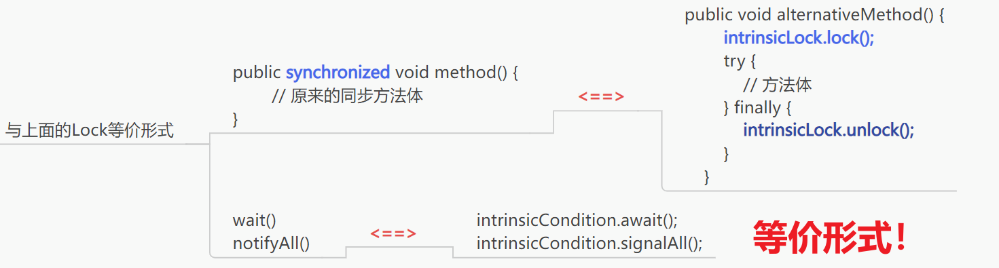

# 一、本质：synchronized是一种Lock系锁的替代，每个对象都有，使用简单但繁重

# 二、工作流程：
如果一个方法声明时有 synchronized关键字，那么对象的锁将保护整个方法。
也就是说，**要调用这个方法，线程必须获得内部对象锁**。

## (一)获得什么类型的锁？

### 1.修饰代码块
 synchronized (this)
  获取当前实例对象的锁
 synchronized(lock)
  获取当前lock对象的锁

### 2.修饰方法——加在方法前面
 调用方法的对象的锁

### 3.修饰类——synchronized (obj.Class)//对应方法是类级别的Static

对比形式

# 三、还是经典的转账的例子——使用synchronized完成类级别的锁！
见同目录下的文件！

# 四、