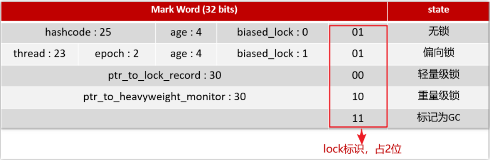

# 一、引出为什么会有锁升级这一说法？——Monitor是OS层面的锁，切换成本较高！
分类：
## 1.重量级锁
  Monitor实现的锁属于**重量级锁**，**使用操作系统的互斥量（Mutex）**来实现**线程阻塞和唤醒**，里面涉及到了**用户态和内核态的切换、进程的上下文切换，成本较高**，性能比较低。

---
## 2.轻量锁

---
## 3.偏向锁

---
# 二、如何区分这三类锁？——对象头上的lock标识

# 三、共5列信息
在对象头上的lock标识里面共5列信息，分别表示：

### 01=>无锁、偏向形锁
(具体区分，见前面的MarkWord的其他组成)
### 00=>轻量级锁

### 10=>重量级锁

### 11=>标记为GC