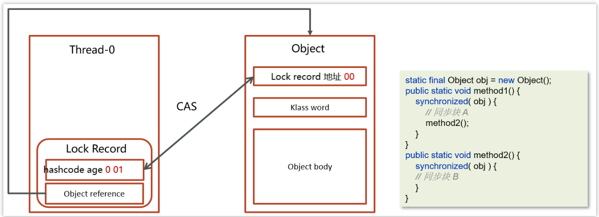
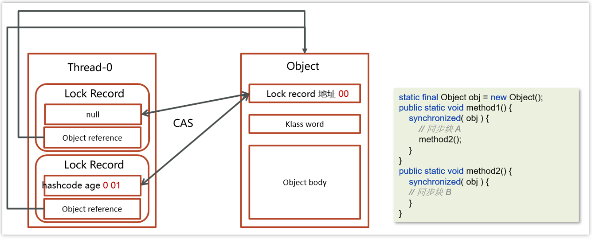
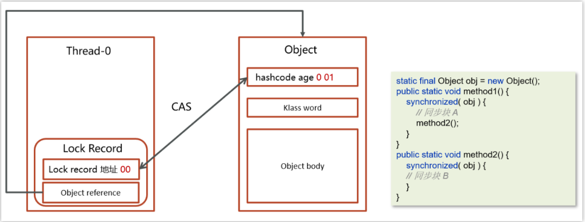

# 最核心的一点：轻量级锁利用CAS进行数据交换以建锁释锁，不使用操作系统的Mutex互斥量了！

# 一、适用场景
 同步块中的代码线程交替进行，**不存在竞争**的情况

# 二、流程
## (一) 上锁
 ### 1.建Lock Record
   在线程栈中创建一个Lock Record，将其obj字段指向锁对象。

### 2.CAS指令存储地址
   通过CAS指令将**Lock Record的地址存储在对象头的mark word**中（**两者数据进行交换**），如果对象处于无锁状态则修改成功，**代表该线程获得了轻量级锁**。

 ### 3. 锁重入
   如果是当前线程已经持有该锁了，代表这是一次锁重入。设置Lock Record第一部分为null，起到了一个重入计数器的作用。

 ### 4. 失败膨胀
   如果CAS修改失败，说明发生了竞争，需要膨胀为重量级锁。

## (一) 解锁
 ### 1.找LockRecord
   **遍历线程栈**,找到**所有obj字段等于当前锁对象的Lock Record**。

 ### 2.锁重入
   如果Lock Record的Mark Word为null，代表这是一次重入，将obj设置为null后continue。

  ### 3.CAS换回信息
   如果Lock Record的 Mark Word不为null，则**再次利用CAS指令**将对象头的mark word恢复成为无锁状态。如果失败则膨胀为重量级锁。

  ### 4. 失败膨胀
   如果CAS换回信息失败，说明发生了竞争，需要膨胀为重量级锁。