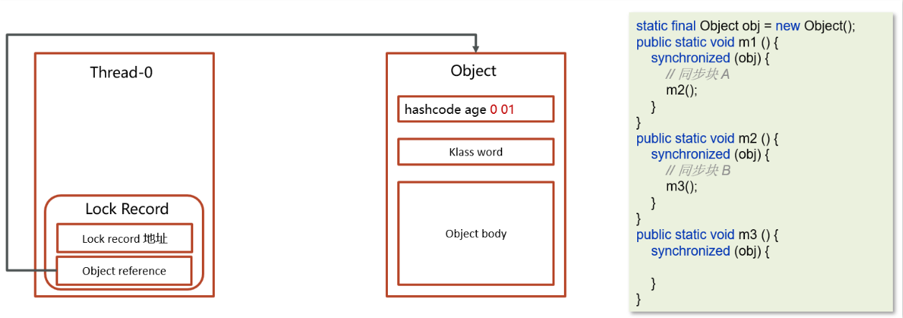
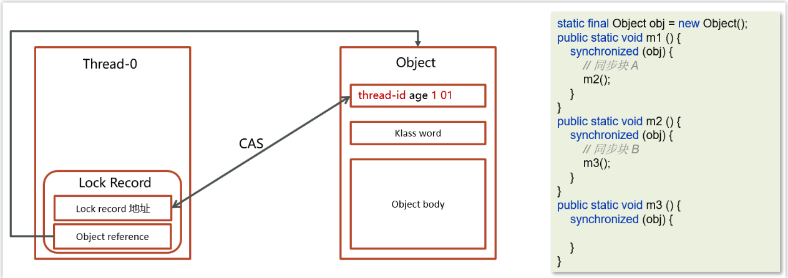
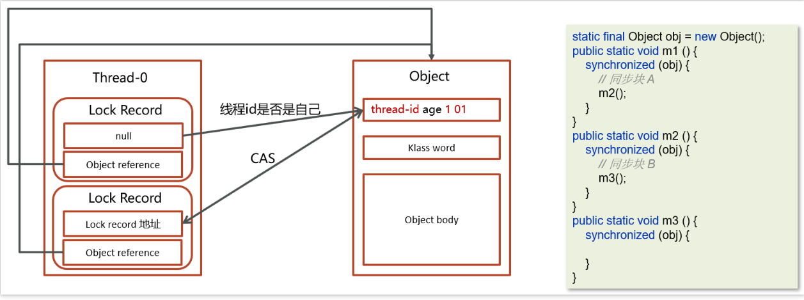

## 最核心的一点：偏向型锁和轻量级锁一致，但是可重入时不需要CAS了！

---
# 一、适用场景——
 同步块中的代码线程交替进行，**不存在竞争**的情况=>自动转化的！

# 二、改进
## 特点
 轻量级锁在没有竞争时（就自己这个线程），每次重入仍然需要执行 CAS 操作。
## 改进
  偏向锁**只有第一次使用 CAS 将线程 ID 设置到对象的 Mark Word 头**，之后发现****这个线程 ID 是自己的**就表示没有竞争，不用重新 CAS。

---

# 二、流程
## (一) 上锁
 ### 1.建Lock Record
   在线程栈中创建一个Lock Record，将其obj字段指向锁对象。

### 2.CAS指令存储地址
   通过CAS指令将**Lock Record的线程id**存储在对象头的mark word中，同时也设置**偏向锁的标识为101**，如果对象处于无锁状态则修改成功，代表该线程获得了偏向锁。

 ### 3. 锁重入
   如果是当前线程已经持有该锁了，代表这是一次锁重入。设置**Lock Record第一部分为null**，起到了一个**重入计数器**的作用。与轻量级锁不同的时，这里**不会再次进行CAS操作**，只是**判断对象头中的线程的ID是否是自己**，因为缺少了CAS操作，**性能相对轻量级锁更好一些**。

 ### 4. 失败膨胀
   如果CAS修改失败，说明发生了竞争，需要膨胀为重量级锁。

---
## (一) 解锁
 ### 1.找LockRecord
   **遍历线程栈**,找到**所有obj字段等于当前锁对象的Lock Record**。

 ### 2.锁重入
   如果Lock Record的Mark Word为null，代表这是一次重入，将obj设置为null后continue。

  ### 3.CAS换回信息
   如果Lock Record的 Mark Word不为null，则**再次利用CAS指令**将对象头的mark word恢复成为无锁状态。如果失败则膨胀为重量级锁。

  ### 4. 失败膨胀
   如果CAS换回信息失败，说明发生了竞争，需要膨胀为重量级锁。