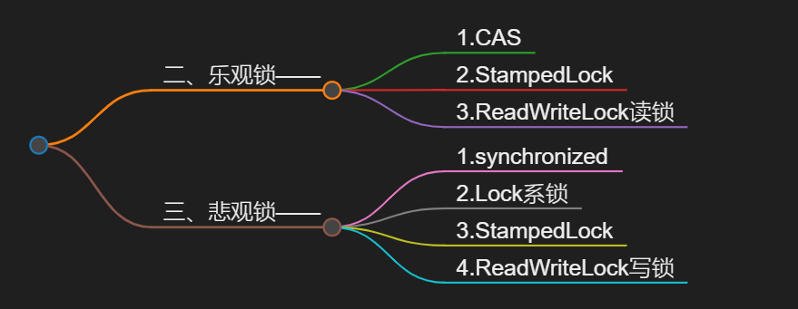

# 一、乐悲观定义
## (一)乐观锁

- 我同步时，**其他线程可以来访问共享资源【共享CPU】**，我同步好了，利用之前的**CAS+版本号**机制，查看是否修改，修改了就在重试

## (二)悲观锁
- 总是假设最坏的情况，**认为**在自己使用共享资源的过程中，**一定会有其他线程来修改这些资源**。所以在访问共享资源之前，它会先加锁，确保在自己使用资源期间，**其他线程无法对其进行修改，直到锁被释放**。

---

## 二、乐观锁——
### 1.CAS

### 2.StampedLock

### 3.ReadWriteLock读锁

## 三、悲观锁——
### 1.synchronized

### 2.Lock系锁

### 3.StampedLock

### 4.ReadWriteLock写锁

