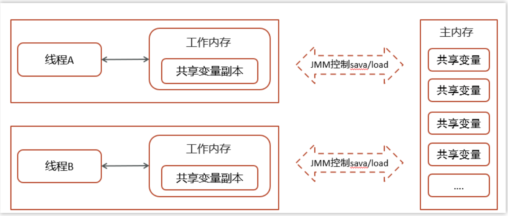

# 一、JMM模型示意图
 

# 二、JMM的工作

## 规定了java中线程间消息通信的规则

1.Java程序中各种变量(**线程共享变量、实例变量、类变量**)的访问规则 

2.JVM中**将变量存储到内存和从内存中读取变量**这样的底层细节。

# 三、JMM的特点

## 1.共享变量存于内存
所有的**共享变量**都存储于主内存(**计算机的RAM**)这里所说的变量指的是**实例变量和类变量**。不包含局部变量，因为局部变量是**线程私有的**，因此不存在竞争问题。  

## 2.线程的工作内存 
每一个线程还**存在自己的工作内存**，线程的工作内存，**保留了被线程使用的变量的工作副本**。  

## 3. 线程间的通信——通过共享内存完成消息通信！
线程对变量的所有的操作(读，写)都**必须在工作内存**中完成，而**不能直接读写主内存中的变量**，不同线程之间也**不能直接访问对方工作内存中的变量**，线程间变量的值的传递**需要通过主内存完成**。

---
# 四、JMM的本质
本地(工作内存)内存是JMM的一个**抽象概念**，并**不真实存在**。它涵盖了**缓存、写缓冲区、寄存器以及其他的硬件和编译器优化**。

---
# 五、核心平衡点
设计JMM时的核心目标就是找到一个好的平衡点：

一方面，要为程序员提供**足够强的内存可见性保证**；

另一方面，对**编译器和处理器的限制**要尽可能地放松。