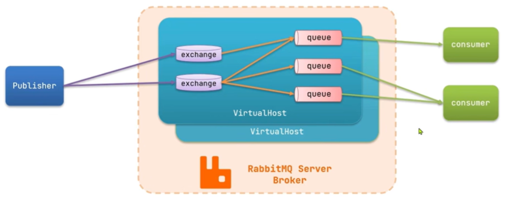

# 0.rabbitmq的架构

# 一、rabbitmq常见概念

## 1.channel：
操作mq的工具
## 2.exchange：
路由消息到队列中，故需要绑定队列
## 3.queue： 
缓存消息，消费者读取并消费消息
## 4.user：
mq的使用者，不同的项目可能用同一个mq做到随时切换
## 5.virtual host：
虚拟主机，是对**exchange(交换机)、queue(队列)等资源的逻辑分组**防止不同的项目使用mq是数据混淆

# 二、整体流程：
生产者**发布**消息，交换机**路由**消息，队列**存储**消息，消费者**监听**队列消费消息