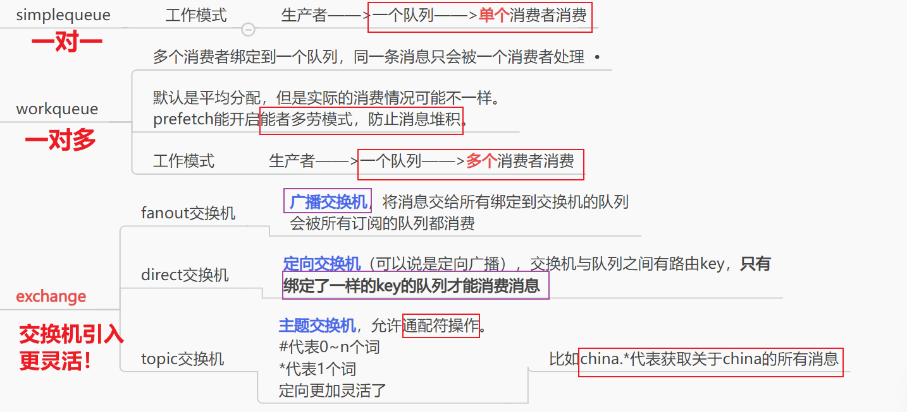

# rabbitmq的五种消费模型

## 一、直连：
### 1.基本消息队列

### 2.工作消息队列

---
## 二、引入交换机：

### 3.发布订阅模型

  发布订阅模型按交换机类型不同分为三种

  #### 3.1.广播
   广播交换机将收到的消息**广播到所有绑定的队列**，而**不考虑路由键**。

  #### 3.2.直连
   直连交换机通过**路由键（Routing Key）**将消息路由到**绑定了相应路由键的队列**。

  #### 3.3.主题
   主题交换机通过模式匹配**路由键（Routing Key）**来将**消息路由到队列**。

----

所以总结来看，**共5类消息通信模型**！