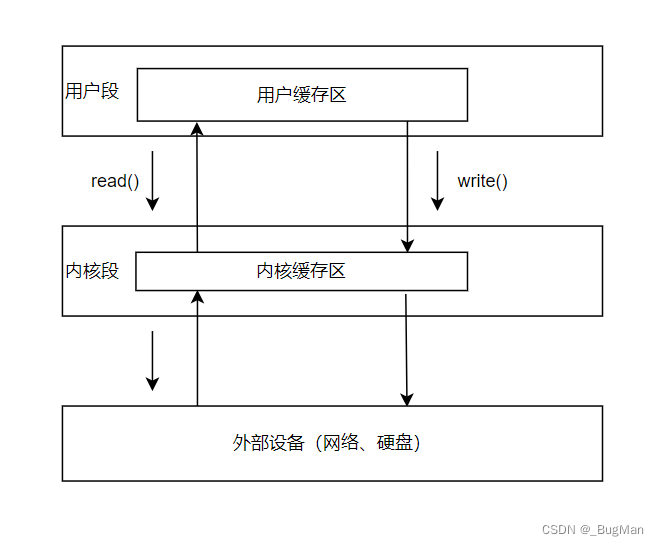

# 一、内存分段和CPU的态
现代计算机在**加载操作系统、正常启动**后，其**内存会主要分成两大段**：内核段+用户段。

## 1.内核段：

操作系统本质上是一个计算机硬件资源的管理程序，该程序相关的所有资源，被**存放在内核段中**。

## 2.用户段：

用户段用来**存放各个进程的数据和指令**。

根据所访问的内存段的不同，**CPU会处于不同的态，访问用户段的时候处于用户态，访问内核段的时候处于内核态**。

# 二、计算机IO的过程

在程序执行时有很多高耗时操作，比如**IO操作**就是。当计算机执行IO操作的时候，IO设备的速度肯定是远远落后于CPU的速度的，**IO没有完成，后续依赖的数据没到位**，程序也没办法继续向下执行，于是**CPU就只好赋闲**，傻傻的等IO执行完成，**再继续向下运行程序，无疑这会造成CPU资源的浪费**，使得计算机的工作效率变得很低。

于是现代操作系统中将CPU划分成了很多时间片，不同时间片可以去运行不同的程序，比如：

这一秒运行的A程序，

下一秒运行的B程序，

再下一秒再运行A程序。

这样间插执行就会避免傻等带来的CPU资源的浪费，如果IO耗时2秒，那么CPU至少还有1秒被其它程序使用到了。

后来操作系统用了**更激进的方式来处理IO指令**，让CPU的时间**一丝一毫都不被浪费**，这种处理方式就是**遇见IO指令**，直接启动IO后，**CPU直接转去执行其它任务**，当IO完成后发送一个**中断信号给CPU**，让CPU中断当前的任务，转过来继续执行IO后的程序：

## 遇见IO指令：
当程序执行到 I/O 指令（比如从硬盘读取数据或者向打印机输出数据）时，CPU 会向相关的 I/O 设备控制器（比如硬盘控制器、打印机控制器等）**发送命令，告诉它要执行什么操作**（比如读取哪个扇区的数据、打印哪些内容等）。这个过程就像是 CPU 给 I/O 设备下达了一个任务。当 I/O 设备完成了 CPU 下达的任务（比如硬盘已经读取到了指定的数据、打印机已经打印完了内容），I/O 设备控制器会向 CPU 发送一个中断信号。这个中断信号就像是 I/O 设备在告诉 CPU：**“我已经完成了你交给我的任务啦，你可以回来接着处理后续的事情了”**

# 三、IO 与内存

计算机进行IO的时候，本质上会为每一个IO设备在内存中分配一块空间，向这块空间里进行读写，即可完成IO。为什么给IO设备分配的内存会是在内核段里？主要是基于两点进行考虑的： 

## • 安全性 
I/O 操作通常需要与计算机的外部设备（如磁盘、网络设备等）进行交互，如果**允许各个进程自己私自与外部设备进行交互**，IO的内存放在各个进程内部，**太散了，不是很好进行安全控制**，相反，如果将IO的内存放在内核段，就很便于集中管理，可以附加一些安全机制上去。 

## • 特权操作  
首先**IO指令本身就是特权指令**，会让**CPU进入内核态**，其次进行**IO的时候会用到中断信号**，也涉及到特权指令，也要求CPU处于内核态，所以如果IO内存是在内核段中，让CPU提前进入内核状态，也避免了后面来回切状态造成的时间浪费。 

# 四、整个IO的流程——四次复制

## 本质：用户一定会以内核态为中介转而向IO设备读取、写入！

整个IO在内存中的流转过程如下： 

读的时候磁盘拷贝到内核段、内核段拷贝到用户段， 

写的时候用户段拷贝到内核段、内核段拷贝到磁盘。 

一共四次复制。

