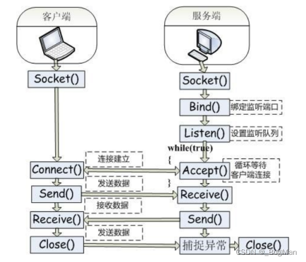

# 1.什么是同步阻塞 

同步、阻塞是两个概念， 

同步，即**原地傻等**，在发出一个调用时，在没有得到结果之前，该调用就不返回。但是一旦调用返回，就得到返回值了。换句话说，就是**由调用者主动等待这个调用的结果**。 **同步是对客户端的描述，在等待服务端响应的请求时，客户端不做其他的事情**。 

阻塞，即**卡住，是对服务端的描述**。服务端会不会因为本来该开始处理请求，进行后续的业务逻辑了，但是因为请求的数据包还没有接收完（因为一个请求不一定是一个数据包发过来的，可能分成了好几个数据包），而需要卡在**原地等待网络IO将数据包**接收完才能继续往下走。

---

# 2.什么是BIO 
BIO，**同步阻塞**，即**传统的JAVA IO**，相关类和接口在**java.io**包下，其线程模型如下：
blocking io

BIO的线程模型呈现出以下特点： **一个连接一个线程，每个连接进来都对应着需要新启一个线程去负责处理该连接**，

可能出现处理连接的 线程被**执行时所需的IO资源未准备好**，造成**线程被阻塞**的情况出现。server端处理连接的请求一旦被阻 塞，client也会因为**收不到响应而阻塞**，因此**client端、server端呈现出同步阻塞的特点**。

---
# 3.Socket=>TCPIP 的封装 

BIO的核心是Socket，Socket是**对TCP/IP通信**过程的一个抽象，它将TCP/IP协议里面复杂的通信逻辑进行封装，对用户来说，只要通过**一组简单的API就可以实现网络的连接和通信**。

---
# 4.BIO的缺点 ——
BIO最后的实现效果是**一个连接一个线程**。

原因是服务端每accept一个socket后，就算主线程接下来去处理这个Socket也只是处理了一个Socket，因此要并发的处理多个Socket，还是只能在服务端起多个线程，**每个线程处理一个Socket**。**因此才说一个Socket对应着一个线程**。

这时就会存在两个问题： 

---
## 1. 耗时严重 
耗时严重： 
accept的socket并不知道其数据包是否已经收完，很可能出现因为数据包没有收完，还需要**阻塞在原地等待IO继续收数据包**的情况，本来分过来的CPU时间片是希望当前线程向下执行代码，**结果用去继续等待IO收数据包去了**，IO操作对于CPU而言很慢，时间片的利用率会很低，耗时会很严重。

---
## 2. 同步阻塞  
同步阻塞： 
一个Socket被阻塞期间，**对映的client端由于没有收到回信，也只有跟着阻塞**，无法继续向下执行，这就造成了client端和server的同步阻塞。

