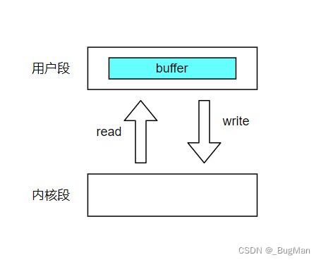
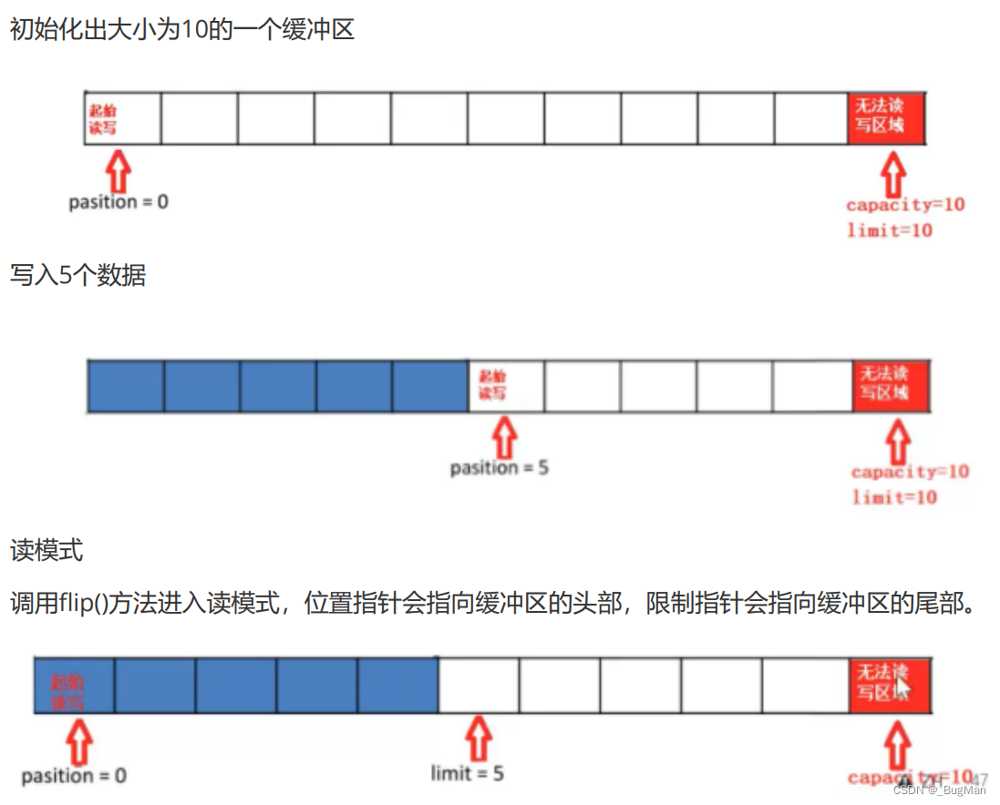

---
# 三、buffer详解

## 1.概述
buffer，理解为用户段中一块内存的抽象即可。


既然是一块内存，那么其**本质上就是用来进行数据读写的一个容器**，由java.nio包定义，**顶级接口为Buffer**，
定义了一套API用来管理缓冲区中的数据针对**存储不同的数据类型**，有不同的buffer： 
```java
ByteBuffer 

CharBuffer

ShortBuffer 

IntBuffer 

LongBuffer

FloatBuffer 

DoubleBuffer
```

## 2.buffer基本属性



buffer具有以下几个基本属性： 

### • 容量（capacity）

buffer的大小，buffer创建后，容量**不能更改**。 

---
### • 限制（limit） 

**buffer可用的大小**，limit之后的区域无法进行读写。 

---
### • 位置（position） 

表示**接下来**要读写的数据的所在位置。 

---
### • 标记（mark） 

**标记一个位置的索引**，调用**reset()方法**可以回到该位置上


---
## 3.buffer API
```java
• Buffer clear() 清空缓冲区并返回对缓冲区的引用 

• Buffer flip()为 将缓冲区的界限设置为当前位置，并将当前位置充值为0

• int capacity() 返回 Buffer 的 capacity 大小 

• boolean hasRemainingO) 判断缓冲区中是否还有元素 

• int Timit0 返回 Buffer 的界限(Timit) 的位置 

• Buffer limit(int n) 将设置缓冲区界限为 n，并返回一个具有新  imit 的缓冲区对象 

• Buffer mark() 对缓冲区设置标记 

• int position() 返回缓冲区的当前位置 position 

• Buffer position(int n) 将设置缓冲区的当前位置为 n ，并返回修改后的 Buffer 对象 

• int remaining() 返回 position 和  imit 之间的元素个数 

• Buffer reset() 将位置 position 转到以前设置的 mark 所在的位置 

• Buffer rewind() 将位置设为为 0， 取消设置的 mark 

• get() : 读取单个字节

• get(byte[] dst): 批量读取多个字节到 dst 中 

• get(int index): 读取指定索引位置的字节(不会移动 position) 

• put(byte b): 将给定单个字节写入缓冲区的当前位置 

• put(byte[] src): 将 src 中的字节写入缓冲区的当前位置 

• put(int index，byte b): 将指定字节写入缓冲区的索引位置(不会移动 position)
```

```java
import java.nio.ByteBuffer;

public class TestBuffer {
    public static void main(String[] args) {
        byte[] resource = "hello".getBytes();
        // 初始化
        ByteBuffer byteBuffer = ByteBuffer.allocate(1024);
        printCapPosLim(byteBuffer);
        // 写
        byteBuffer.put(resource);
        printCapPosLim(byteBuffer);

        // 开启读模式
        byteBuffer.flip();

        // 标记当前位置
        byteBuffer.mark();

        // 读取一个字节
        System.out.println((char) byteBuffer.get());
        printCapPosLim(byteBuffer);

        // 读取剩余全部数据
        byte[] remainingData = new byte[byteBuffer.remaining()];
        byteBuffer.get(remainingData);
        System.out.println(new String(remainingData));
        printCapPosLim(byteBuffer);

        // 回到标记点
        byteBuffer.reset();
        printCapPosLim(byteBuffer);
    }

    private static void printCapPosLim(ByteBuffer byteBuffer) {
        System.out.println("缓冲空间为:" + byteBuffer.capacity());
        System.out.println("指针指向为:" + byteBuffer.position());
        System.out.println("缓冲空间限制为:" + byteBuffer.limit());
        System.out.println();
    }
}
```
## 实验结果

