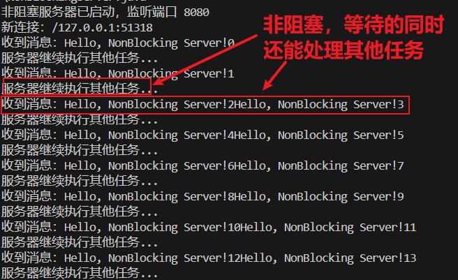

# 非阻塞服务端 代码

结果示意图：


```java
public class NonBlockingServer {
    public static void main(String[] args) {
        try {
            // 创建服务器套接字通道
            ServerSocketChannel serverSocketChannel = ServerSocketChannel.open();
            // 设置为非阻塞模式
            serverSocketChannel.configureBlocking(false);
            // 绑定监听端口
            serverSocketChannel.bind(new InetSocketAddress(8080));
            System.out.println("非阻塞服务器已启动，监听端口 8080");

            while (true) {
                // 接受客户端连接，非阻塞模式下没有连接会返回 null
                SocketChannel socketChannel = serverSocketChannel.accept();
                if (socketChannel != null) {
                    System.out.println("新连接：" + socketChannel.getRemoteAddress());
                    // 设置为非阻塞模式
                    socketChannel.configureBlocking(false);

                    // 准备缓冲区
                    ByteBuffer buffer = ByteBuffer.allocate(1024);

                    // 持续监听该客户端的后续数据
                    while (true) {
                        // 读取客户端数据，非阻塞模式下没有数据会返回 0
                        int bytesRead = socketChannel.read(buffer);
                        if (bytesRead > 0) {
                            buffer.flip();
                            byte[] data = new byte[buffer.remaining()];
                            buffer.get(data);
                            String message = new String(data);
                            System.out.println("收到消息：" + message);
                            buffer.clear();
                        } else if (bytesRead == -1) {
                            // 客户端关闭连接
                            System.out.println("客户端 " + socketChannel.getRemoteAddress() + " 已关闭连接");
                            socketChannel.close();
                            break;
                        }
                        // 可以在这里执行其他任务
                        System.out.println("服务器继续执行其他任务...");
                        Thread.sleep(1000);
                    }
                }
            }
        } catch (IOException | InterruptedException e) {
            e.printStackTrace();
        }
    }
}

```