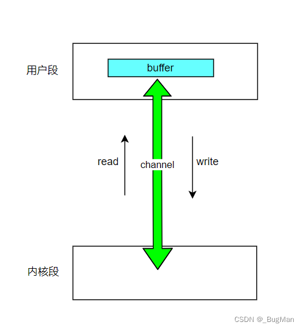

# channel

## 一、概述 
概述 Channel，通道，**由java.nio.channel包下定义**，用来**向buffer中读写数据**，可以理解为**内核段和用户段之间进行数据传输的一条逻辑通道**，
甚至可以**直接理解为内核段中内存的一个抽象**。



## 二、特性
通道具有以下特性： 

• **全双工，读写可以同时进行**，即可以向缓冲区中写，又可以向缓冲区中读 

• **支持异步**  Channel是一个顶级父接口，针对需要传输的数据格式的不同分为： 

```java
• FileChannel 用于读取、写入、映射操作文件 

• DatagramChannel 用于通过UDP读写网络中的数据 

• SocketChannel 通过TCP读写网络中的数据，底层封装的Socket 

• ServerSocketChannel SocketChannel的升级版，可以自动监听新的TCP连接，每一条新连接创建一个SocketChannel。  
```

## 三、通道的获取
可以从以下地方获取不同的通道： 
```java
• FileInputStream 

• FileOutStream 

• RandomAccessFile 

• Socket ServerSocket
```

## 四、API
读写 
## 1.channel.write(buffer);
用channel将buffer中的数据写出来
```java
public class TestChannal1 {
    public static void main(String[] args) {
        // 磁盘里面的东西转化为IO流，放在内核中！
        try (FileOutputStream fileOutputStream = new FileOutputStream("Buffer1.txt")) {
            // 获取file类型的channal（内核通道）
            FileChannel channel = fileOutputStream.getChannel();
            // 准备好要写出的位置(即内存)
            ByteBuffer buffer = ByteBuffer.allocate(1024);
            buffer.put("those date were wrote by kernel".getBytes());
            // 将buffer换成读模式
            buffer.flip();
            // 要使用内核写出
            channel.write(buffer);
            channel.close();
        } catch (IOException e) {
            // TODO Auto-generated catch block
            e.printStackTrace();
        }
    }
}
```

## 2.channal.read(buffer)
用channal将数据从内存里面读到内存buffer中
```java
public class TestChannal2 {
    public static void main(String[] args) {
        try {
            // 获取文件流
            FileInputStream fileInputStream = new FileInputStream("Buffer2Channel.txt");
            // 获取file类型的内核操作区域抽象Channel
            FileChannel channel = fileInputStream.getChannel();
            // 获取内存空间抽象Buffer
            ByteBuffer byteBuffer = ByteBuffer.allocate(1024);
            // 由内核向内存里面写
            int i = channel.read(byteBuffer);
            System.out.println("读写个数："+i+"Byte");
            // 打印内存内容
            System.out.println(new String(byteBuffer.array()));
            fileInputStream.close();
        } catch (IOException e) {
            e.printStackTrace();
        }
    }
}
```