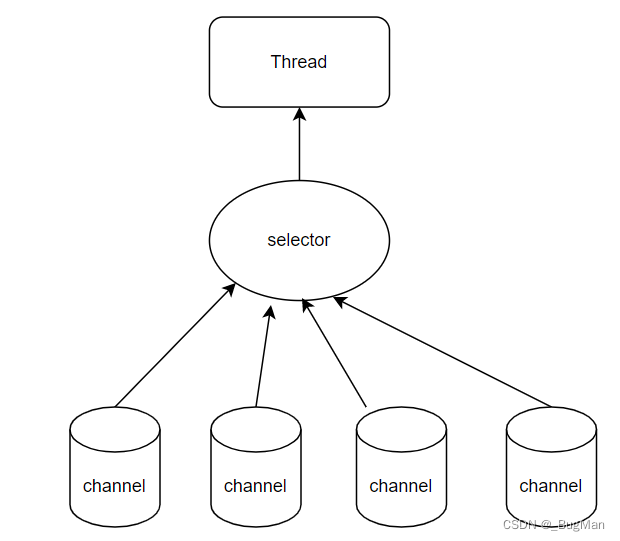

# 一、selector 概述 

## (一)核心机制：挑选出触发时间的Channal！
NIO实现非阻塞式IO的**核心是selecto**r，它的功能很简单，就是用**事件机制来监听channel**，**挑选出触发事件的channel**。

 我们知道，如果线程中有IO操作，IO没有完成，资源没有准备好之前，线程是会进入阻塞状态的。我们可以**用单线程起一个selector去监听channel是否准备好数据，将准备好数据的channel挑选出来交给其它线程去处理**，这样就不会因为IO资源没准备好导致线程阻塞。 
 
 我猜大家看到这里会有一个疑惑，什么时候会有上面描述的这种用线程去并发的处理IO？ 网络通信的时候 如果用BIO的方式通信一进来就给一个线程去处理，那么就会有可能因为数据包还没收完，IO等待、阻塞，造成线程阻塞。而**用NIO的话就可以用selector挑选出数据包收完的IO出来处理，不会有线程阻塞**：

---
## (二)通道监听事件类型

**通道的监听事件**一共有如下类型： 

既可以用常量表示，也可以用数字表示。 

#### • 读 SelectionKey.OP_READ 1 

#### • 写 SelectionKey.OP_WRITE 4 

#### • 连接 SelectionKey.OP_CONNECT 8 

#### • 接收 SelectionKey.OP_ACCEPT 16 

#### • 复合 若不止一个事件时，**使用或操作符连接**

