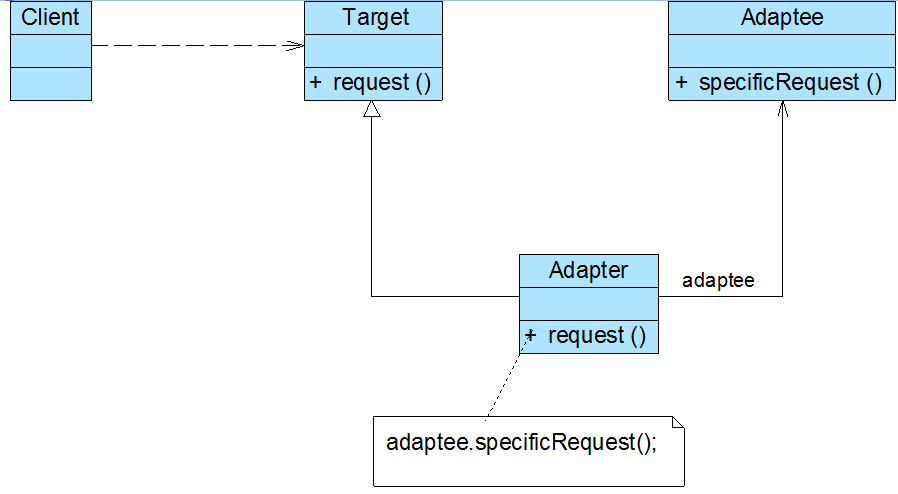
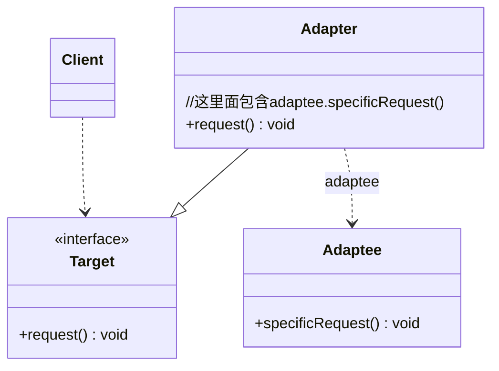

# 一、生活联想1——充电器电压适配
 我的笔记本电脑的工作电压是20V，而我国的家庭用电是220V，**如何让20V的笔记本电脑能够在220V的电压下工作**？答案是**引入一个电源适配器**(AC Adapter)，俗称**充电器或变压器**，有了这个电源适配器，生活用电和笔记本电脑即**可兼容**。

  在软件开发中，有时也存在类似这种不兼容的情况，我们也可以像引入一个电源适配器一样引入一个称之为**适配器的角色来协调这些存在不兼容的结构**，这种设计方案即为适配器模式。

----
# 二、实际项目——没有源码的算法库(接口已写，但是源码不见了)
# 本质——匹配两个不兼容的接口
我开发了一个学生管理系统，但是里面涉及分数排序、查找的接口使用的是ScoreOperation(),对接的原算法库的接口,但是现在的我的原算法代码不见了,如果我换成其他的算法代码，必定会改动大量的原代码，怎么办？
这里可以采用一个**适配器**，将其他算法代码里面的方法与我的ScoreOperation()适配，那么我就可以调用其他算法库了！

---
# 三、适配器模式定义
适配器模式(Adapter Pattern)：
**将一个接口转换成客户希望的另一个接口**，使**接口不兼容的那些类可以一起工作**，其别名为**包装器**(Wrapper)。适配器模式既可以作为类结构型模式，也可以作为对象结构型模式。

# 四、包含角色与类图
### ● Target（目标抽象类）：

目标抽象类定义客户所需接口，可以是一个抽象类或接口，也可以是具体类。        

### ● Adapter（适配器类）：

适配器可以调用另一个接口，作为一个转换器，对Adaptee和Target进行适配，适配器类是适配器模式的核心，在对象适配器中，它**通过继承Target并关联一个Adaptee对象**使二者产生联系。        

### ● Adaptee（适配者类）：

适配者即被适配的角色，它定义了一个已经存在的接口，这个接口需要适配，适配者类一般是一个具体类，包含了客户希望使用的业务方法，在某些情况下可能没有适配者类的源代码。

