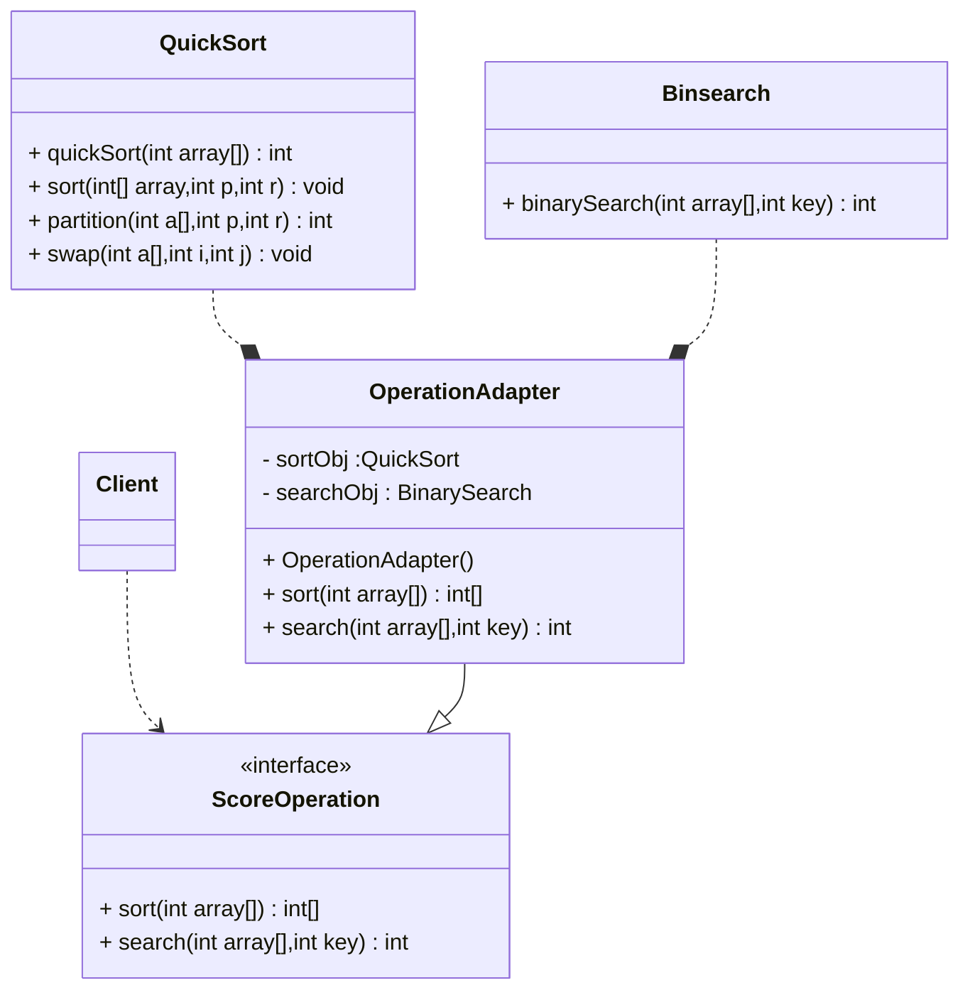

# 类图

```mermaid
classDiagram
    class Client{
    }

    class ScoreOperation{
        + sort(int array[]) int[]
        + search(int array[],int key) int
    }
    << interface >> ScoreOperation
%%这里声明类的类型是接口！
    class OperationAdapter{
        - sortObj :QuickSort
        - searchObj : BinarySearch
        + OperationAdapter()
        + sort(int array[]) int[]
        + search(int array[],int key) int
    }

    class QuickSort{
        + quickSort(int array[]) int
        + sort(int[] array,int p,int r) void
        + partition(int a[],int p,int r) int
        + swap(int a[],int i,int j) void
    }
    class Binsearch{
        + binarySearch(int array[],int key) int
    }

    Client..>ScoreOperation
    OperationAdapter--|>ScoreOperation
    QuickSort..*OperationAdapter
    Binsearch..*OperationAdapter
```