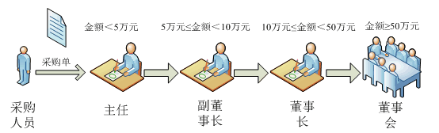

# 一、生活联想1——斗地主

某人**出牌给他的下家，下家看看手中的牌**，如果**要不起上家的牌**则将**出牌请求再转发给他的下家**，其下家再进行判断。一个循环下来，如果其他人都要不起该牌，则最初的出牌者可以打出新的牌。
在这个过程中，**牌作为一个请求沿着一条链在传递，每一位纸牌的玩家都可以处理该请求**。在设计模式中，我们也有一种**专门用于处理这种请求链式传递**的模式，它就是本章将要介绍的职责链模式。

# 二、生活联想2+实际项目——分级采购
