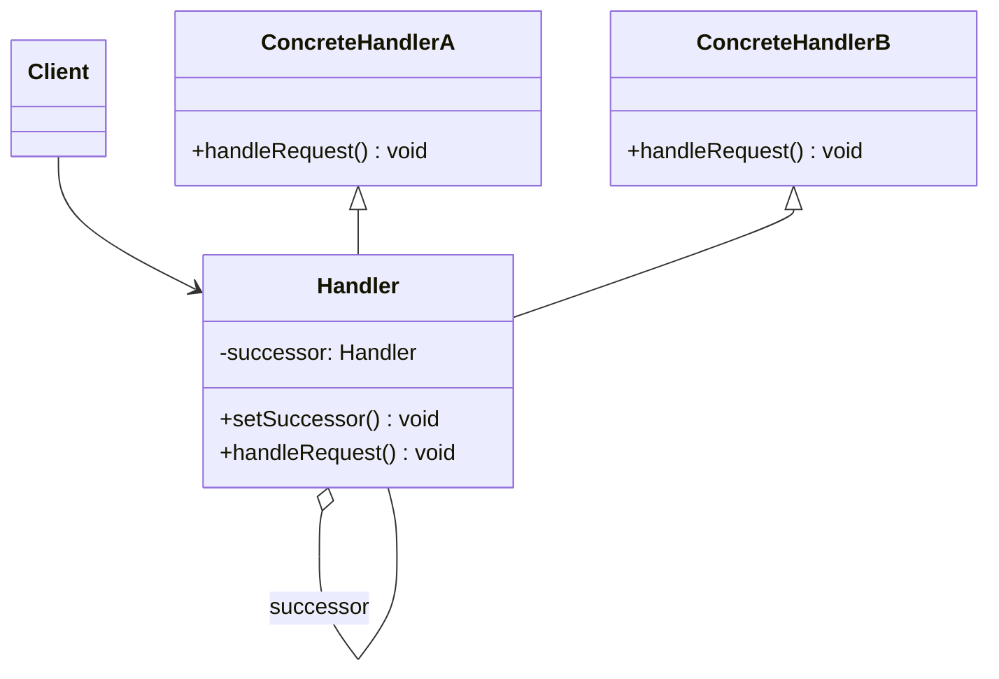

## 一、画类图
工具是mermaid,学会~
官网：https://mermaid.live/edit

## 二、详解各个组件
可以看到这里最重要的就是Handler抽象类了，他有两个作用：
---
#### 1.作为抽象类，定义子类规范，方便职责的添加与删除
---
#### 2.内含抽象类自身(所以不能用接口)，方便建立责任链

---
## 三、注意：

1.责任链里面的setSuccessor的作用就是建立责任链的!

2.职责链模式并**不创建职责链**，职责链的创建工作必须由系统的其他部分来完成，一般是在使用该职责链的客户端中创建职责链。职责链模式**降低了请求的发送端和接收端之间的耦合**，使多个对象都有机会处理这个请求。 
