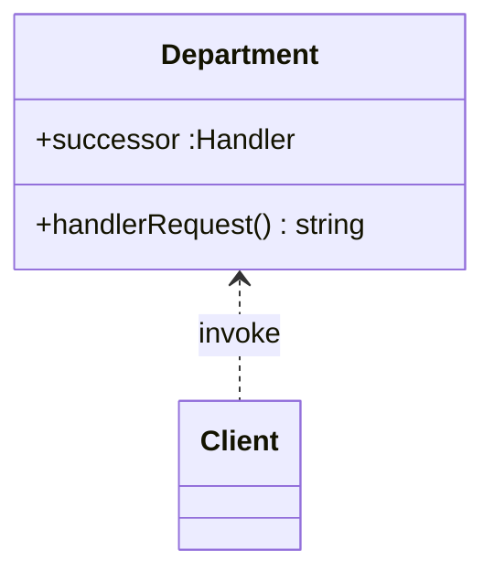
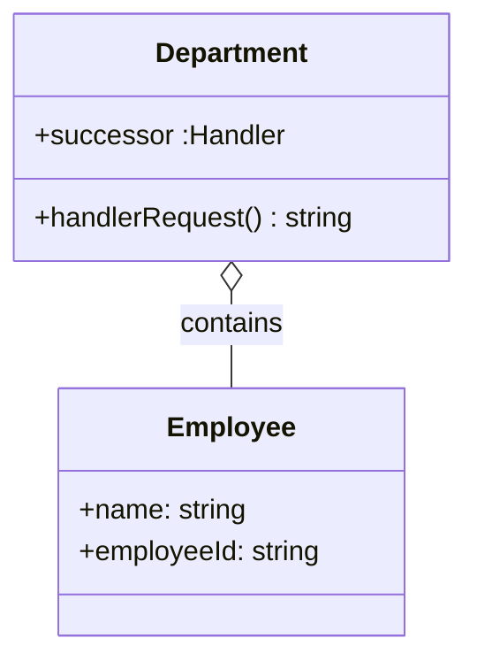
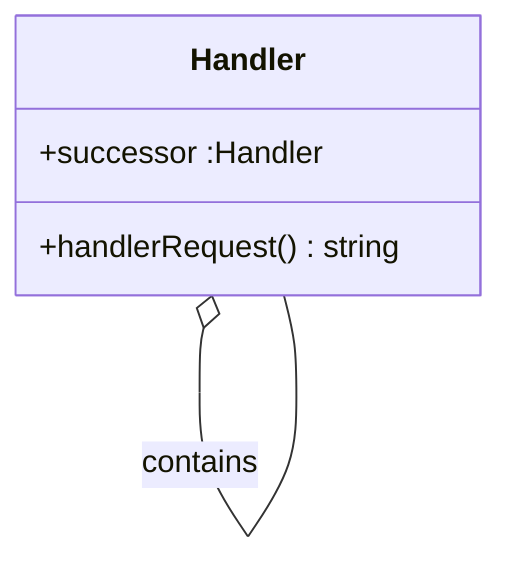

# 一、依赖

```mermaid
classDiagram
    class Department {
        +successor :Handler
        +handlerRequest() string
    }
    class Client {
        
    }
    Department <..  Client : invoke
```

# 聚合
## 双方聚合

```mermaid
classDiagram
    class Department {
        +successor :Handler
        +handlerRequest() string
    }
    class Employee {
        +name: string
        +employeeId: string
    }
    Department o-- Employee : contains
```

## 自身聚合：

```mermaid
classDiagram
     class Handler {
        +successor :Handler
        +handlerRequest() string
    }
   Handler o-- Handler : contains
```
