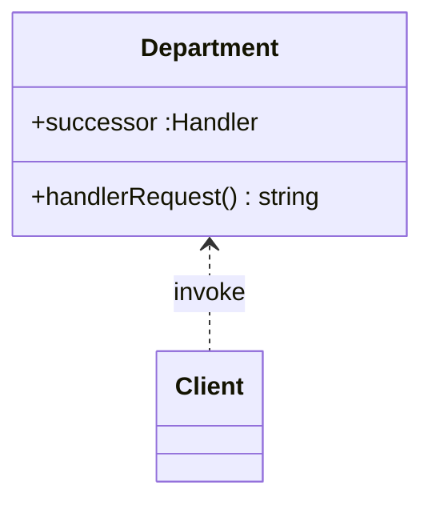
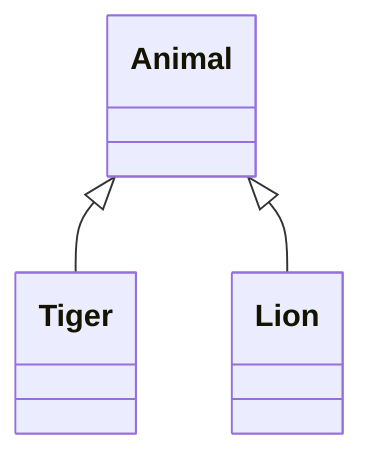
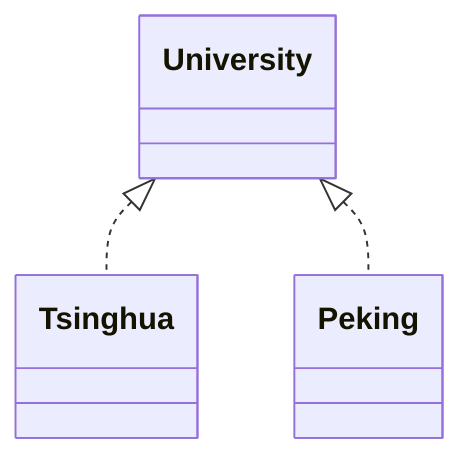
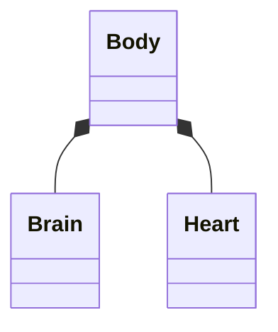
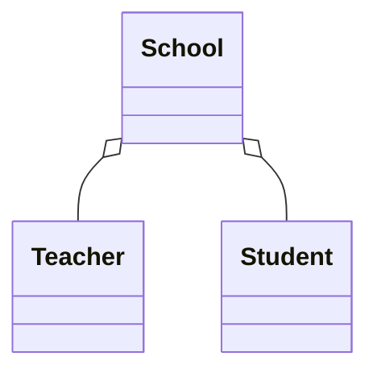
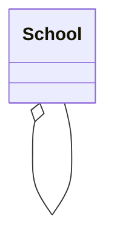

# 一、依赖

```mermaid
classDiagram
    class Department {
        +successor :Handler
        +handlerRequest() string
    }
    class Client {
        
    }
    Department <..  Client : invoke
```

# 二、继承

```mermaid
classDiagram
Animal <|-- Tiger
Animal <|-- Lion
```

# 三、实现

```mermaid
classDiagram
University <|.. Tsinghua
University <|.. Peking
```

# 四、组合

```mermaid
classDiagram
Body *-- Brain
Body *-- Heart

```

# 五、聚合
## 1.双方聚合

```mermaid
classDiagram
    School o-- Teacher
    School o-- Student

```

## 2.自身聚合：

```mermaid
classDiagram
    School o-- School
```
