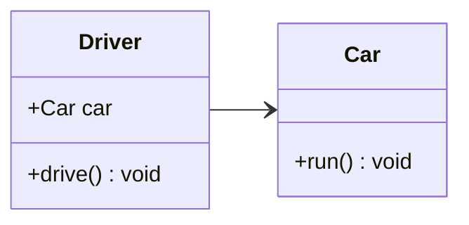

# 方向 
### 语法direction TB/BT/RL/LR，默认TB
T=>Top
B=>Bottom

LR 从左到右

RL：从右到左

TB：从上到下

BT：从下到上

```mermaid
classDiagram
    direction LR
    class Car {
        +run() void
    }
    class Driver {
        +Car car
        +drive() void
    }
    Driver --> Car
```