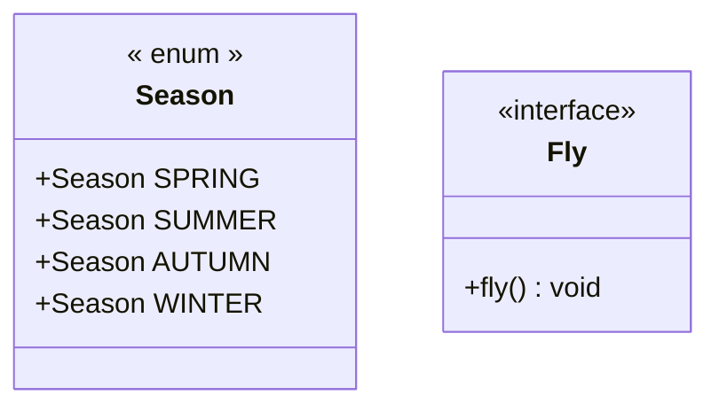

# 一、表明一个类是接口、枚举、抽象类

```mermaid
classDiagram
    class Season {
        << enum >>
        +Season SPRING
        +Season SUMMER
        +Season AUTUMN
        +Season WINTER
    }

    class Fly
    << interface>> Fly
    Fly: +fly() void
```

----
# 二、类上添加链接

```mermaid
classDiagram
class Blog
    link Blog "https://www.xiehai.win" "This is a tooltip for a link"
```