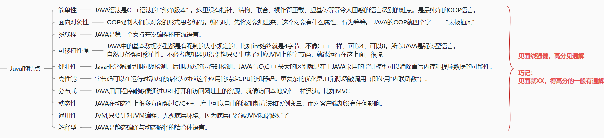

# 一图解前言：

---
# 巧记：
见面现XX，高分的人一般有通解
---
# Java的特点
## 简单性
JAVA语法是C++语法的 "纯净版本" 。这里没有指针、结构、联合、操作符重载、虚基类等等令人困惑的语言级别的难点。是最纯净的OOP语言。
## 面向对象性
OOP强制人们以对象的形式思考编码。编码时，先将对象想出来，这个对象有什么属性、行为等等。 JAVA的OOP就四个字—— "太极抽风"
## 多线程
JAVA是第一个支持并发编程的主流语言。
## 可移植性强
JAVA中的基本数据类型都是有强制的大小规定的，比如int始终就是4字节，不像C++一样，可以4，可以8。所以JAVA是强类型语言。自然具备强可移植性。不必考虑机器见得架构只要生成了对应JVM上的字节码，就能运行在这上面，很嘎
## 健壮性
Java非常强调早期问题检测、后期动态的运行时检测。JAVA与C\C++最大的区别就是在于JAVA采用的指针模型可以消除重写内存和损坏数据的可能性。
## 高性能
字节码可以在运行时动态的转化为对应这个应用的特定CPU的机器码。更复杂的优化是JIT消除函数调用（即使用"内联函数"）。
## 分布式
JAVA用用程序能够像通过URL打开和访问网址上的资源，就像访问本地文件一样迅速。比如MVC
## 动态性
JAVA在动态性上很多方面强过C/C++。库中可以自由的添加新方法和实例变量，而对客户端却没有任何影响。 在JAVA中找出运行时类型信息很简单（详细信息请点击这里）。
## 通用性
只要针对JVM编程，无视底层环境，因为底层已经被JVM和谐做好了
## 解释型
JAVA是静态编译与动态解释的结合体语言。

