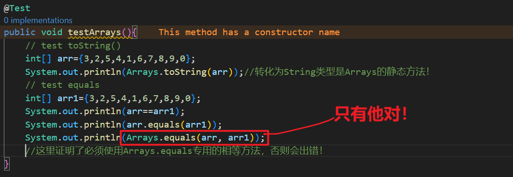

# 一、Arrays方法大全
注意：Arrays的所有方法对基本类型的数组都有效，实际上，Arrays就是为了基本类型而生的！复合类型用的是Collections

# 注意，这里的方法对所有基本类型都有效，并且全部是静态方法！

---
## 1.排序(可按区间),可自定义方式！
### sort()
public static void sort(int[] a)

### sort(arr,l,r)
public static void sort(int[] a, int fromIndex, int toIndex)
注意toIndex不包含！

## 2.二分查找(可按区间)
### binarySearch(arr,key)
public static int binarySearch(int[] a, int key)

### binarySearch(arr,key,l,r)
public static int binarySearch(int[] a, int fromIndex, int toIndex, int key)

## 3.判等(长度+元素)
### equals
public static boolean equals(int[] a, int[] a2)


## 4.填充
### fill(可按区间)
public static void fill(int[] a, int val)

public static void fill(int[] a, int fromIndex, int toIndex, int val)

## 5.复制数组(可指定范围，可延长)
### copyOf(arr,len)
public static int[] copyOf(int[] original, int newLength)

超出长度的使用0填充

### copyOfRange(arr,start,to)
public static int[] copyOfRange(int[] original, int from, int to)

### clone(int[])
直接全部复制！深复制！

## 6.toString()字符串表示
public static String toString(int[] a)：返回 int 类型数组的字符串表示。

## 7.Arrays.equals(arr1,arr2);判等专用~~
 注意 需要使用Arrays.的专有的，不然使用Object的，会直接判错，因为基本类型数组类不是复合类，是单独的！
 

 ```java
System.out.println(arr==arr1);
System.out.println(arr.equals(arr1));
System.out.println(Arrays.equals(arr, arr1));
//这里证明了必须使用Arrays.equals专用的相等方法，否则会出错！
 ```


## 8.stream()流化处理
注意，如果是使用倒序的话，sort()允许接受Comparator的reverseOrder()方法，但是不能是**基本类型**，所以要包装成复合类型Boxed！

```java
Integer[] array = Arrays.stream(arr1).boxed().toArray(Integer[]::new);
Arrays.sort(array, Comparator.reverseOrder());//倒序接口！
System.out.println(Arrays.toString(array));
//要使用这个接口倒序，必须实现这个方法，但是基本类型无法实现，所以要转化成对应复合类型！
```