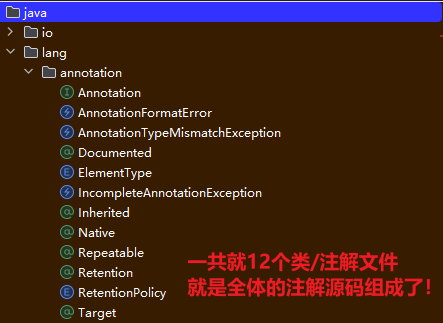

# 定义：
在 Java 中，注解（Annotation） 是一种元数据形式，用于为代码提供额外的信息。**注解本身不会直接影响代码的逻辑**，
但它们可以**被编译器、开发工具或运行时环境读取和处理**，从而实现特定的功能或行为。

## 举例：
例如：前面的@interfaceFunction注解就会向编译器传达一个命令：如果这个接口不满足只拥有唯一一个抽象方法，就编译失败！从而达到对代码的增强！

## 作用：
### 1.编译时检查
@Override检查父类有无子类相同的签名方法,@interfaceFunction注解检测是不是函数式接口。
### 2.简化配置
@Service、@Component、@Repository等注解用于标记类为Spring中的组件。而无需XML配置。
### 3.标识依赖注入
@Autowire表示可以标记一个字段、构造方法、Setter方法，表示Spring应该自动注入相应的依赖。
### 4.标识AOP
例如，Spring中的@Transactional注解可以将一个方法标记为事务性操作，Spring会在方法执行前后自动开启和提交事务， 而不需要开发者手动管理事务逻辑。
### 5.代码生成与处理
注解处理器（Annotation Processors）可以在编译时生成额外的代码。例如，Lombok使用注解生成常见的Java代码（如getter、setter、equals、hashCode等方法），减少样板代码的编写。
### 6.文档生成
例如，@Documented注解标记的注解会出现在JavaDoc文档中。注解可以为API添加文档注释，自动生成清晰的API文档。


# 常见注解有哪些？
说明，元注解全在包下java.lang.anntotion下

## 元注解
## 1.@Target
#### 作用：
指定注解的使用范围(字段、方法、类？)
#### 使用举例：
```java
@Target(value = {ElementType.TYPE,ElementType.METHOD})
public @interface MyAnnotation {}
```
#### 说明：
指定了MyAnnotation注解可以用在类、接口、注解类型、枚举类型、记录类型以及方法上面，自定义注解上也可以不使用@Target注解，如果不使用，表示自定义注解可以用在任何地方。
TYPE枚举指明的就是类级别的文件

## 2.@Retention
#### 作用
指定(注解会被保留到什么时候？)
### 定义:
```maven
java程序的3个阶段
1.源码阶段
2.源码被编译为字节码之后变成class文件
3.字节码被虚拟机加载然后运行
```
用@Retention来表示注解会保留在哪个阶段。
### RetentionPolicy枚举
```java
public enum RetentionPolicy { 
SOURCE,/*注解只保留在源码中，编译为字节码之后就丢失了，也就是class文件中就不存在了*/
CLASS, /*注解只保留在源码和字节码中，运行阶段会丢失*/
RUNTIME/*源码、字节码、运行期间都存在*/ 
}//逐层叠加的！！
```
## 3.@Inherited
用于指定注解是否具有继承性。当一个注解被 @Inherited 修饰后，它会被子类所继承。默认情况下，注解是不具有继承性的，即子类不会继承父类的注解。
## 4.@Documented
用于指定注解是否包含在 Java 文档中。
## 5.@Native
只是某个字段的值是在 Java 代码之外（通常是本地代码）定义和初始化的，并且在 Java 代码中可以将其视为一个常量来使用
## 6.@Repeatable
指定一个注解可以在同一个声明上重复使用。

# 自己定义注解
## 语法
使用@interface来定义
## 标准定义
```maven
public @interface 注解名称{
    [public] 参数类型 参数名称1() [default 参数默认值];
    [public] 参数类型 参数名称2() [default 参数默认值];
    [public] 参数类型 参数名称n() [default 参数默认值];
}
```
## 举例1
```java
// 定义一个名为 MyConfig 的注解
@Target({ElementType.TYPE, ElementType.METHOD})// @Target 注解指定该注解可以应用的目标元素类型，这里表示可以用于类和方法
@Retention(RetentionPolicy.RUNTIME)// @Retention 注解指定该注解的保留策略，这里表示在运行时也可以通过反射访问该注解
public @interface MyConfig {
    public String name() default "defaultName";// 定义一个字符串类型的参数，名为 name，默认值为 "defaultName"
    public int age() default 18; // 定义一个整数类型的参数，名为 age，默认值为 18
    public boolean isEnabled() default true;// 定义一个布尔类型的参数，名为 isEnabled，默认值为 true
}
```

## 举例2
这就是一个名为MyAnnotation的注解
这是一个无参注解，注解参数可有可无。
```java
public @interface MyAnnotation {
    
}
```
## 参数特点
参数类型只能是基本数据类型、String、Class、枚举类型、注解类型（体现了注解的嵌套效果）以及上述类型的一位数组。
参数的名称一般定义为名词，如果**注解中只有一个元素**，**请把名字起为value**（后面使用会带来便利操作）。
参数名称()，**仅仅只是一个特殊的语法**
default代表默认值，值必须和第2点定义的类型一致
如果没有默认值，代表后续使用注解时必须给该类型元素赋值

## 