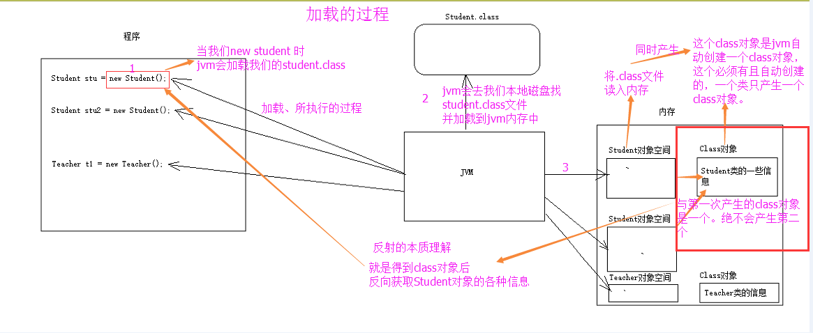

# 反射
# 定义
## 一句话：
### 反射就是在运行时通过Class对象获得类的各个信息的机制

Java反射机制是指在**运行状态**中，**对于任意一个类，都能够知道这个类的所有属性和方法**；
对于**任意一个对象，都能够调用他的任意一个方法和属性**； 这种**动态获取信息及动态调用方法的功能称为Java语言的反射机制**。

# 本质——通过Class对象动态获取类信息——名称、方法、字段、父类、接口等！
所以反射依靠的Class对象，那么怎么获取Class对象呢？

# Class对象 
## 1.本质：.class文件代表
Class对象是.class文件的对象形式的表示，JAVA所有信息都在.class文件里面，所以全部信息肯定也在.Class对象里面

## 2.创建——JVM+类加载器创建
Class对象是在加载类时由 Java 虚拟机以及通过调用类加载器(C++编写的)中的 defineClass方法自动构造的。
**与.class文件一一对应**。Class类**没有公共构造方法**。也就只能又JVM创建。

## 获取Class对象的三种方式
### 1.实例.getClass()
object有方法getClass()

### 2.类/基本类型.class
任何数据类型（包含基本类型）**都有一个静态的class属性**

### 3.Class.forName(String className)
通过Class类的类路径静态方法 

