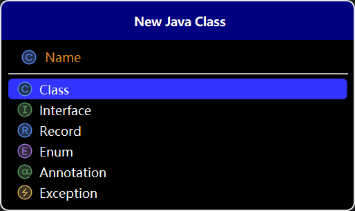

# class
传统的类文件

# interface
接口类文件
作用：1实现can-do
限制：无字段、实现者必须全部实现方法

# Record
## 作用：
14引入，简洁地表示**不可变final的数据载体**，自动生成构造函数、访问器、equals、hashCode 和 toString 方法
```java
//这是一种简便的实现不可变数据的方式！
public record Point(int x, int y) {
    public int area(){
        return x*y;
    }
}
```
---

# Enum
## 作用：
枚举用于定义一组固定的常量，常用于表示**有限的取值集合，如星期、季节**等
## 特点
1.构造函数私有
2.枚举的实例定义即创建！

## 举例
```java
public enum Days {
    //这里的字段就是每一个实例！
    MONDAY("星期一"),
    TUESDAY("星期二"),
    WEDNESDAY("星期三"),
    THURSDAY("星期四"),
    FRIDAY("星期五"),
    SATURDAY("星期六"),
    SUNDAY("星期日");

    private final String chineseName;

    // 构造函数，用于初始化每个枚举常量的中文名
    Days (String chineseName) {
        this.chineseName = chineseName;
    }
    // 获取中文名的方法
    public String getChineseName() {
        return chineseName;
    }
}
```
---

# Annotation
## 作用：
注解用于为程序代码添加元数据信息，如**说明、配置**等，在编译期或运行时被工具或框架处理
## 举例：
```java
//此注解用于指定程序运行时间
@Target(ElementType.METHOD) // 该注解只能用于方法
@Retention(RetentionPolicy.RUNTIME) // 该注解在运行时可用
public @interface LogExecutionTime {
}
```
---

# Exception
## 作用：
异常类用于处理程序运行时出现的错误或异常情况，分为**受检异常**和**非受检异常**

# 受检异常
### 定义
受检异常是指在**编译时**必须进行处理的异常，否则代码将**无法通过编译**。
### 举例：
常见的受检异常有 IOException、SQLException

# 非受检异常
### 定义
非受检异常是指在编译时不需要强制处理的异常(**即运行时异常**)，通常继承自 **java.lang.RuntimeException** 类。

### 举例：
```java
public class UncheckedExceptionExample {
    public static void main(String[] args) {
        int[] numbers = {1, 2, 3};
        try {
            int value = numbers[5];// 尝试访问数组越界的元素
            System.out.println("获取到的值: " + value);
        } catch (ArrayIndexOutOfBoundsException e) {
            // 捕获并处理 ArrayIndexOutOfBoundsException 异常
            System.out.println("处理 ArrayIndexOutOfBoundsException: " + e.getMessage());
        }
    }
}
```
## 自定义异常


