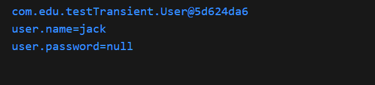

## transient关键字
# 作用：指定该变量在对象序列化时不被持久化存储。
# 背景：
当一个对象被序列化时，Java 默认会将对象的**所有非transient实例变量**的值写入到**输出流**中。
而被transient修饰的变量，其值在序列化时会**被忽略**，不会被写入到序列化后的字节流中。

# 使用场景：
## 一、保护敏感信息：
对于一些包含敏感信息的变量，如**密码、用户隐私数据**等，使用transient关键字可以防止这些信息在序列化过程中被泄露。
## 二、节省空间和提高效率：
有些变量在对象反序列化后可以根据其他信息重新计算得出，或者在序列化时不需要保存其值，
将这些变量标记为transient，可以**减少序列化后的数据量**，提高序列化和反序列化的效率。

代码演示
```java
package com.edu.testTransient;

import java.io.Serializable;

public class User implements Serializable{
    String name;
   transient String  password;
    public User(String name, String password) {
        this.name = name;
        this.password = password;
    }
    public String getName() {
        return name;
    }
    public String getPassword() {
        return password;
    }
}
// 测试类
public class testTransient {
    @Test
    public void test() throws FileNotFoundException, IOException, ClassNotFoundException{
        User user0 = new User("jack", "123456");
        // 序列化对象
        ObjectOutputStream objectOutputStream = new ObjectOutputStream(new FileOutputStream("user0.obj"));
        objectOutputStream.writeObject(user0);
        // 反序列化对象
        ObjectInputStream objectInputStream = new ObjectInputStream(new FileInputStream("user0.obj"));
        User user1 = (User)objectInputStream.readObject();
        System.out.println(user1.toString());
        System.out.println("user.name="+user1.getName());
        System.out.println("user.password="+user1.getPassword());
    }   
}

```
## 测试结果
