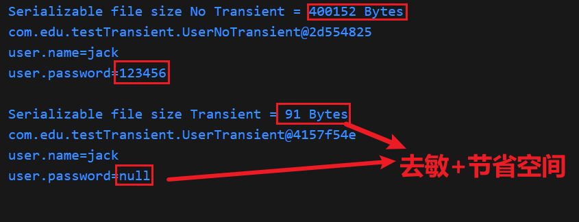

## transient关键字
# 作用：指定该变量在对象序列化时不被持久化存储。
# 背景：
当一个对象被序列化时，Java 默认会将对象的**所有非transient实例变量**的值写入到**输出流**中。
而被transient修饰的变量，其值在序列化时会**被忽略**，不会被写入到序列化后的字节流中。

# 使用场景：
## 一、保护敏感信息：
对于一些包含敏感信息的变量，如**密码、用户隐私数据**等，使用transient关键字可以防止这些信息在序列化过程中被泄露。
## 二、节省空间和提高效率：
有些变量在对象反序列化后可以根据其他信息重新计算得出，或者在序列化时不需要保存其值，
将这些变量标记为transient，可以**减少序列化后的数据量**，提高序列化和反序列化的效率。

代码演示
```java
public class UserTransient implements Serializable{
   String name;
   transient String  password;
   transient int[] arr=new int[100000]; 
    public UserTransient(String name, String password) {
        this.name = name;
        this.password = password;
    }
    public String getName() {
        return name;
    }
    public String getPassword() {
        return password;
    }
}

public class UserNoTransient implements Serializable {
    String name;
    String password;
    int[] arr = new int[100000];
    public UserNoTransient(String name, String password) {
        this.name = name;
        this.password = password;
    }

    public String getName() {
        return name;
    }

    public String getPassword() {
        return password;
    }
}

public class testTransient {
    UserNoTransient userNoTransient = new UserNoTransient("jack", "123456");
    UserTransient userTransient=new UserTransient("jack","123456");

    @Test
    public void test() throws FileNotFoundException, ClassNotFoundException, IOException {
        NoTransient(userNoTransient);
        System.out.println();
        Transient(userTransient);
    }

    public void NoTransient(UserNoTransient userNoTransient) throws FileNotFoundException, IOException, ClassNotFoundException {
        // 序列化对象
        ObjectOutputStream objectOutputStream = new ObjectOutputStream(new FileOutputStream("user.obj"));
        objectOutputStream.writeObject(userNoTransient);
        // 获取序列化文件的大小
        File fileWithoutTransient = new File("user.obj");
        // 序列化文件的长度
        long TransientSize = fileWithoutTransient.length();
        System.out.println("Serializable file size No Transient = " + TransientSize + " Bytes");
        // 反序列化对象
        ObjectInputStream objectInputStream = new ObjectInputStream(new FileInputStream("user.obj"));
        UserNoTransient user = (UserNoTransient) objectInputStream.readObject();
        System.out.println(user.toString());
        System.out.println("user.name=" + user.getName());
        System.out.println("user.password=" + user.getPassword());
    }

    public void Transient(UserTransient userTransient) throws FileNotFoundException, IOException, ClassNotFoundException {
        // 序列化对象
        ObjectOutputStream objectOutputStream = new ObjectOutputStream(new FileOutputStream("user.obj"));
        objectOutputStream.writeObject(userTransient);
        // 获取序列化文件的大小
        File fileWithoutTransient = new File("user.obj");
        // 序列化文件的长度
        long TransientSize = fileWithoutTransient.length();
        System.out.println("Serializable file size Transient = " + TransientSize + " Bytes");
        // 反序列化对象
        ObjectInputStream objectInputStream = new ObjectInputStream(new FileInputStream("user.obj"));
        UserTransient user = (UserTransient) objectInputStream.readObject();
        System.out.println(user.toString());
        System.out.println("user.name=" + user.getName());
        System.out.println("user.password=" + user.getPassword());
    }
}

```
## 测试结果
