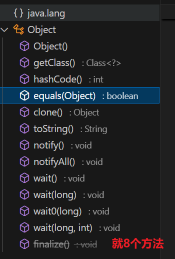

# 一、Obejct预览

# 二、方法讲解：

## 1.getClass() 方法
返回运行时类

方法签名：public final native Class<?> getClass();

## 2. hashCode() 方法
返回对象的哈希码，用于在哈希表中快速查找对象！

方法签名：public native int hashCode();

## 3. equals(Object obj) 方法
比较对象的**引用**是否相等！

方法签名：public boolean equals(Object obj);

## 4. clone() 方法
创建并返回此对象的一个副本。要使用该方法，类必须实现 Cloneable 接口，否则会抛出 CloneNotSupportedException 异常。

方法签名：protected native Object clone() throws CloneNotSupportedException;

## 5. toString() 方法
功能：返回该对象的**字符串表示**。默认情况下，返回的字符串包含类名和对象的哈希码。通常需要在子类中重写该方法以提供更有意义的字符串表示。

方法签名：public String toString();

## 6.notify() 方法
功能：唤醒在此对象监视器上等待的单个线程。如果有多个线程在等待，则**随机选择一个线程唤醒**。

方法签名：public final native void notify();

## 7. notifyAll() 方法
功能：唤醒**在此对象监视器上**等待的所有线程。

方法签名：public final native void notifyAll();

使用示例：可以参考 notify() 方法的示例，将 notify() 替换为 notifyAll() 即可唤醒所有等待的线程。

## 8. wait() 方法（有三个重载版本）
wait() 方法签名：public final void wait() throws InterruptedException;

功能：使当前线程等待，**直到其他线程调用此对象的 notify() 或 notifyAll() 方法**。

----

## 9.wait(long timeout) 含时间等待

功能：使当前**线程等待**，直到其他线程调用**此对象的 notify() 或 notifyAll() 方法**，
或者指定的时间（以毫秒为单位）已过。

## 10. finalize() 方法

方法签名：protected void finalize() throws Throwable;

功能：当垃圾回收器确定不存在对该对象的更多引用时，由对象的垃圾回收器调用此方法。该方法在 **Java 9 及以后版本中已被弃用**，不建议使用。

弃用原因：因为垃圾回收的复活机制太复杂了，回收流程太繁琐，对性能消耗太大了！

----
# 三、总结：
Object的方法共10个，在实际开发中，我们经常会**重写 equals()、hashCode() 和 toString() 方法**来满足特定的需求。
比如String类就重写了**equals方法**，使之**完成内容比较**！