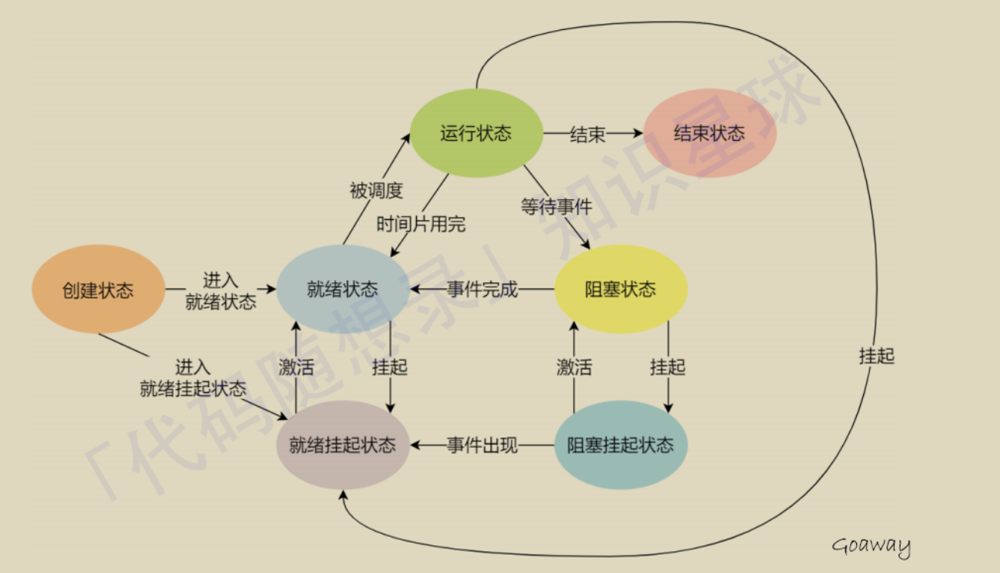

# 一、进程的5大状态
### 1.运⾏态：
 该时刻进程占⽤CPU

### 2.就绪态：
 可运⾏，由于其他进程处于运⾏状态⽽暂时停⽌运⾏ 

### 3.阻塞态：
 该进程正在等待某⼀事件发⽣（如等待输⼊/输出操作的完成）⽽暂时停⽌运⾏

### 4.创建状态（new）：
 进程正在被创建时的状态；

### 5.结束状态（Exit）：
 进程正在从系统中消失时的状态；

---
## 新增的两种状态：挂起状态——没有实际占用物理内存的状态！
### 为什么会有挂起状态？

如果有⼤量处于阻塞状态的进程，**进程可能会占⽤着物理内存空间**，所以系统通常会**把阻塞状态的进程的物理内存空间换出到硬盘**，等需要再次运⾏的时候，再从**硬盘换⼊到物理内存**，那么，就需要⼀个新的状态，**来描述进程没有占⽤实际的物理内存空间的情况**，这个状态就是挂起状态。这跟阻塞状态是不⼀样，阻塞状态是等待某个事件的返回。

挂起状态可以分为两种：

### 6.阻塞挂起状态：

进程在外存（硬盘）并等待某个事件的出现；

### 7.就绪挂起状态：

 进程在外存（硬盘），但只要进⼊内存，即刻⽴刻运⾏；

---
# 二、7大状态及其转换

---

# 三、进程的状态特点

### 1.一双向，全单向 
只有就绪态和运⾏态可以相互转换，其它的都是单向转换。就绪态的进程通过调度算法从⽽获得CPU 时间，转为运⾏状态；

### 2.运行态到就绪态 
运⾏态的进程，在分配给它的 CPU 时间⽚⽤完之后就会转为就绪状态，等待下⼀次调度。

### 3. 运行态到阻塞态
阻塞态是因**缺少需要的资源从⽽由运⾏态转换⽽来**，但是该资源**不包括 CPU 时间**，缺少 CPU 时间**会从运⾏态转换为就绪态**。

### 4. 阻塞态到就绪态 
当进程等待的外部事件发⽣时（如⼀些输⼊到达），则由**阻塞态转换为就绪态**，如果此时没有其他进程运⾏，则转换为运⾏态，否则该进程将处于就绪态，等待CPU空闲轮到它运⾏。

