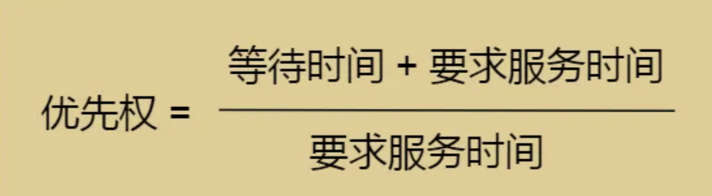

# 进程调度算法

## 一、先来先服务算法(FCFS)
first come first in

每次从**就绪队列选择最先进⼊队列的进程**，然后⼀直运⾏，直到**进程退出或被阻塞**，才会继续从队列中**选择第⼀个进程**接着运⾏。
这种算法虽然看上去公平，但是**如果有⼀个⻓作业需要处理，则后⾯的短作业需要处理很⻓时间**。

先来先调度算法的特点是算法简单，**对⻓作业⽐较有利，对短作业不利**，适⽤于 **CPU 繁忙型作业的系统**，⽽**不适⽤于 I/O 繁忙型作业的系统**。

---
## 二、最短作业优先调度算法（SJF）
short job first

最短作业优先调度算法**从就绪队列**中选择⼀个**估计运⾏时间最短的作业**，将之调⼊到内存中运⾏，这有利于提⾼系统的吞吐量。
但是这**对⻓作业⼗分不利**，由于调度程序**总是优先调度短作业**，将会导致⻓作业⻓期不被调度，此外该算法也**没有考虑到作业的紧迫程度**，因此不能保证紧迫性作业会被及时处理。

---
## 三、⾼响应⽐优先调度算法

### 公式
优先权 = 要求服务时间/(等待时间 +要求服务时间)

每次进⾏进程调度时，先计算**响应⽐优先级**，然后把「响应⽐优先级」**最⾼的进程**投⼊运⾏
根据公式可以知道：

作业的等待时间相同时，如果**要求服务时间越短，则响应⽐更⾼**，有利于短作业执⾏
当要求服务时间相同时，响应⽐由等待时间决定，如果等待时间越⻓，则响应⽐越⾼

对于⻓作业，作业的响应⽐可以随着等待时间的增加⽽提⾼

---
## 四、时间⽚轮转调度算法

**每个进程被分配⼀个时间段**，称为**时间⽚（Quantum）**，即**允许该进程在该时间段中运⾏**。
如果时间⽚⽤完，进程还在运⾏，那么将会把此进程从 CPU 释放出来，并把 CPU 分配给另外⼀个进程；
如果该进程在时间⽚结束前阻塞或结束，则 CPU ⽴即进⾏切换；
另外，时间⽚的⻓度就是⼀个很关键的点：

如果时间⽚设得太短会**导致过多的进程上下⽂切换，降低了 CPU 效率**；
如果设得太⻓⼜可能**引起对短作业进程的响应时间变⻓**。

⼀般来说，时间⽚设为 20ms~50ms 通常是⼀个⽐较合理的折中值。

---
## 五、最⾼优先级调度算法

从就绪队列中选择**最⾼优先级**的进程运⾏，但进程的优先级可以分为**静态优先级和动态优先级**

### 1.静态优先级：

优先级在创建进程时已经确定，在进程运⾏期间保持不变，确定静态优先级的主要依据有进程类型，对资源的要求，⽤户要求。

### 2.动态优先级：

进程运⾏过程中，根据进程运⾏时间和等待时间等因素调整进程的优先级，但是这种算法可能会导致**低优先级的进程永远不被执⾏**。

---
## 六、多级队列调度算法
上⾯的各种调度算法是**固定且单⼀的**，⽆法满⾜系统中**不同⽤户对进程调度策略的不同要求**，多级队列调度算法在
系统中**设置多个就绪队列**，将**不同类型或性质的进程**固定分配到不同的就绪队列，每个队列可以实施不同的调度算法。

## 七、多级反馈队列调度算法

多级反馈队列调度算法融合了**时间⽚轮转调度算法**和**优先级调度算法**，通过动态调整进程的优先级和时间⽚⼤⼩，

多级反馈队列调度算法可以兼顾多⽅⾯的系统⽬标

多级反馈队列调度算法的实现思想如下：

### 1.梯度优先级就绪队列
设置多个就绪队列，并为每个队列赋予不同的优先级。第1级队列的优先级最⾼，第2级队列的优先级次之，其余队列的优先级逐个降低。

---
### 2.高优先级，时间片越小
赋予各个队列的进程****运⾏时间⽚的⼤⼩各不相同**。在优先级越⾼的队列中，每个进程的时间⽚就越⼩。
例如，第 i+1 级队列的时间⽚要⽐第i级队列的时间⽚⻓1倍。

---
### 3.FCFS算法+时间片轮转算法
每个队列**都采⽤FCFS算法**。当新进程进⼊内存后，⾸先将它放⼊第1级队列的末尾，按**FCFS原则等待调度**。
当轮到该进程执⾏时，如它能在该时间⽚内完成，便可撤离系统。若它在⼀个时间⽚结束时尚未完成，调度程序
**将其转⼊第2级队列的末尾等待调度**：若它在第2级队列中**运⾏⼀个时间⽚**后仍未完成，再将它放⼊第3级队
列…，依此类推。当进程最后被降到第n级队列后，在第n级队列中**便采⽤时间⽚轮转⽅式**运⾏。

---
### 4.按队列优先级调度
按队列优先级调度。**仅当第1级队列为空时，才调度第2级队列中的进程运⾏**；仅当第 1~i-1 级队列均为空
时，才会调度第i级队列中的进程运⾏。若处理机正在执⾏第i级队列中的某进程时，⼜有新进程进⼊**任⼀优先级较⾼**
的队列，此时须⽴即把正在运⾏的进程放回到**第i级队列的末尾**，⽽把处理机**分配给新到的⾼优先级进程**。