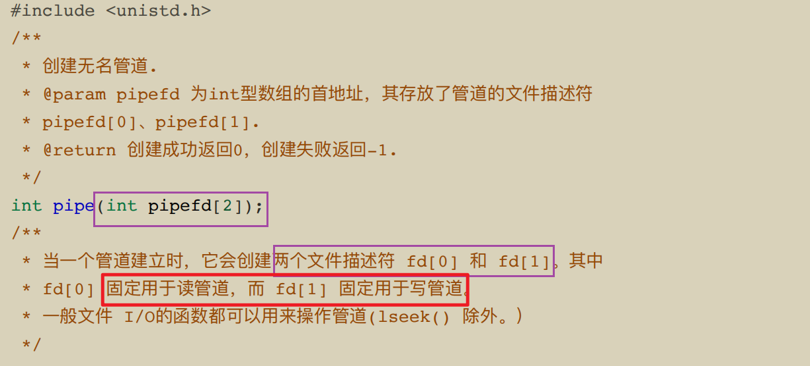

# 一、管道
管道是指⽤于连接⼀个**读进程**和⼀个**写进程**以实现它们之间的通信的**⼀个共享⽂件**，⼜名**pipe⽂件**，向管道（共享⽂件）提供输⼊的发送进程（写进程），以字符流形式将⼤量的数据送⼊（写）管道：⽽接收进程（即读进程）则从管道中接收（读）数据。

## (一)管道特点：
### 1.半双工通信
管道传输数据是**半双⼯通信**，某⼀时刻**只能单向传输** 。

### 2.FIFO
写⼊管道中的数据遵循**先⼊先出**的规则

### 3.⽆格式输出
管道所传送的数据是**⽆格式的**，这要求管道的读出⽅与写⼊⽅必须事先约定好数据的格式，如多少字节算⼀个消息等

### 4.本质是内存的一个缓冲区
管道不是普通的⽂件，不属于某个⽂件系统，其**只存在于内存中**，管道**在内存中对应⼀个缓冲区**, 不同的系统其⼤⼩不⼀定相同

### 5.一次性操作
从管道读数据是**⼀次性操作，数据⼀旦被读⾛，**它就从管道中被抛弃**，释放空间以便写更多的数据

### 6.效率低，不适合频繁交换数据
**通信效率低**，不适合进程间频繁地交换数据。

----
## (二)匿名管道和命名管道之间的区别

### 1.匿名管道：

没有名字的管道，⽤完就销毁， Linux 中的|就是⼀个匿名管道，只适⽤于**⽗⼦进程之间的通信**。

### 2.命名管道：
提前创建了⼀个**类型为管道的设备⽂件**，在进程⾥**只要使⽤这个设备⽂件，就可以相互通信**，所以它可
以在**不相关的进程间进⾏通信**。

---
### (三) pipe函数

