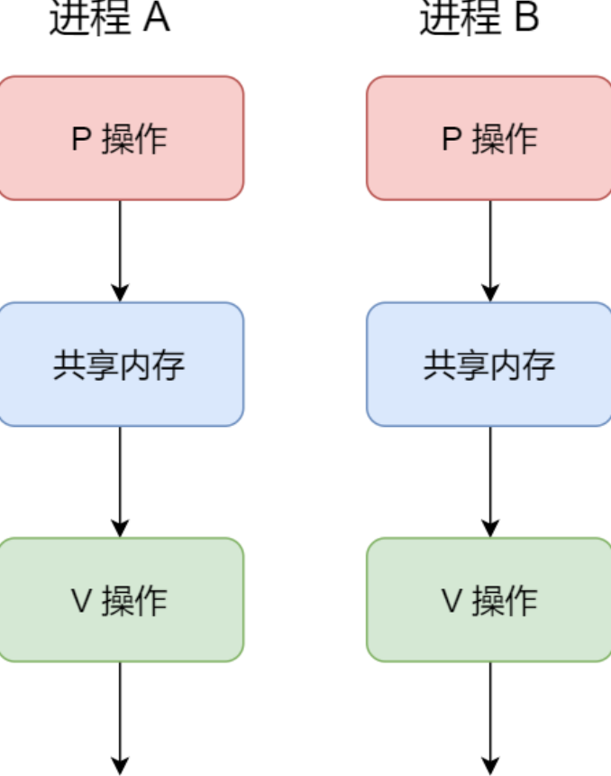

# 一、信号量——整型计数器

信号量⽤于控制**多个进程对共享资源的访问**，⽐如**避免因为多个进程同时修改同⼀个共享内存造成冲突**，信号量可
以使**共享的资源在任意时刻只能被⼀个进程访问**。

信号量其实是⼀个**整型的计数器**，主要⽤于**实现进程间的互斥与同步**，⽽不是⽤于缓存进程间通信的数据。

进程可以执⾏**两种基本操作来操作信号量**：

---
## 二、本质：设为1表示互斥，设为0表示同步。操作信号量先p后v，-1、+1

## 1.P（Wait）操作：-1

这个操作会把信号量减去 1，**相减后如果信号量 < 0，则表明资源已被占⽤**，进程需阻塞等
待；**相减后如果信号量 >= 0，则表明还有资源可使⽤，进程可正常继续执⾏**。

----
## 2.V（Signal）操作：+1

这个操作会把信号量加上 1，**相加后如果信号量 <= 0，则表明当前有阻塞中的进程**，于是
**会将该进程唤醒运⾏**；**相加后如果信号量 > 0，则表明当前没有阻塞中的进程**；

---
# 二、信号量互斥同步

如果两个进程访问共享内存，我们可以**初始化信号量为1**。

进程 A 在访问共享内存前，**先执⾏了 P 操作**，由于信号量的初始值为 1，故在进程 A **执⾏ P 操作后信号量变为 0**，**表示共享资源可⽤**，于是**进程 A 就可以访问共享内存**。

若此时，进程 B 也想访问共享内存，执⾏了 P 操作，**结果信号量变为了 -1，这就意味着临界资源已被占⽤**，
因此**进程 B 被阻塞**。

直到进程 A 访问完共享内存，**才会执⾏ V 操作**，使得**信号量恢复为 0**，接着就会唤醒阻塞中的线程 B，使得
进程 B 可以访问共享内存，最后完成共享内存的访问后，执⾏ V 操作，使信号量恢复到初始值 1。

可以发现，**信号初始化为 1 ，就代表着是互斥信号量**，它可以保证共享内存在任何时刻只有⼀个进程在访问，这就
很好的保护了共享内存。

还可以使⽤信号量**实现多进程同步，⽐如可以初始化信号量为0**。