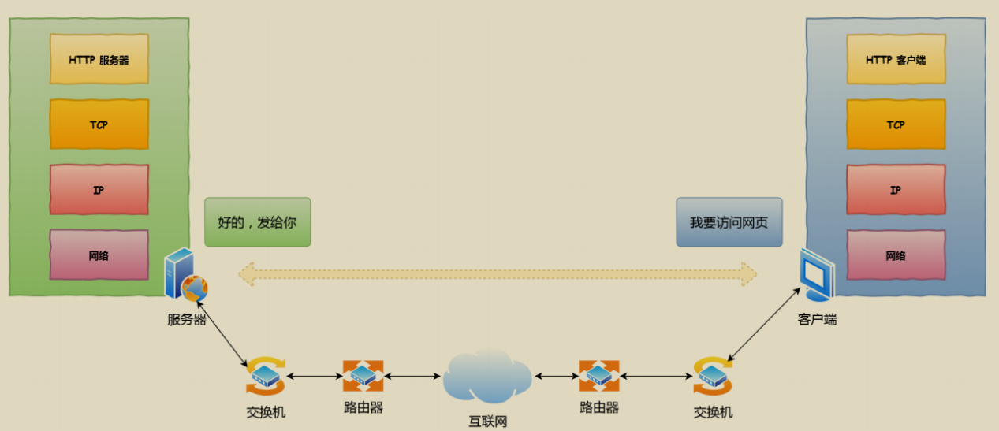
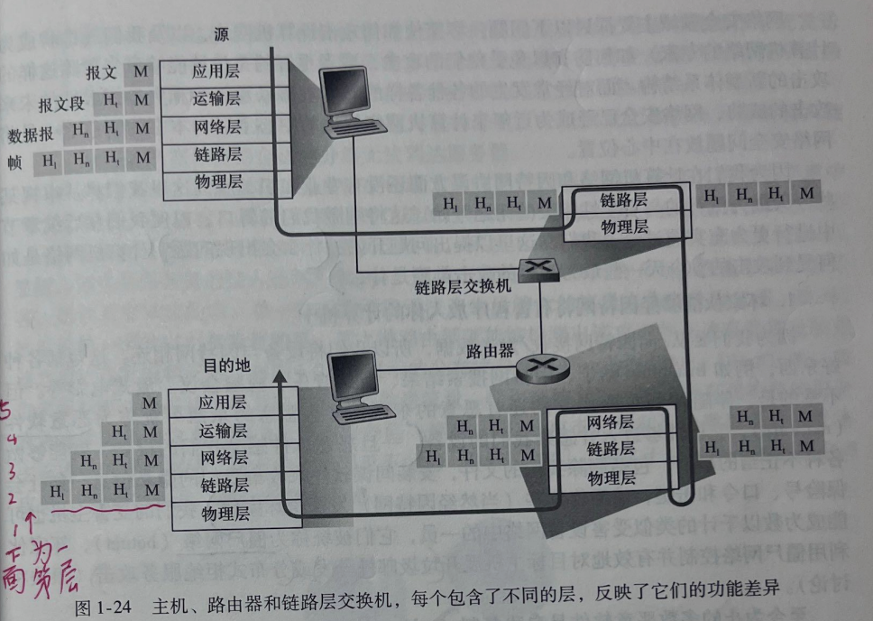
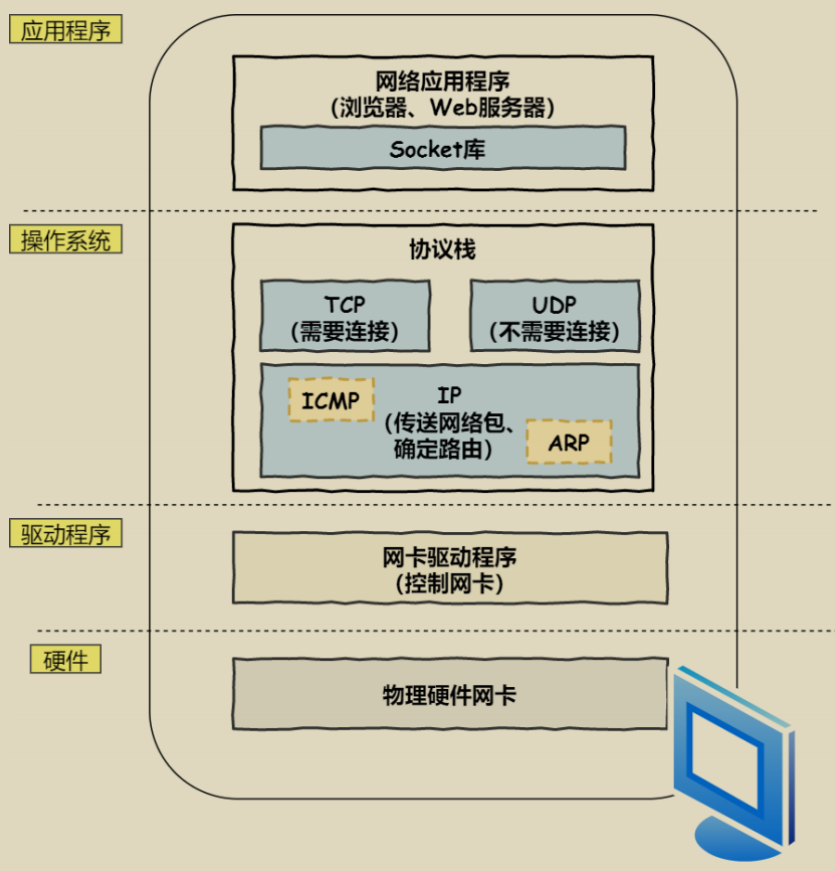
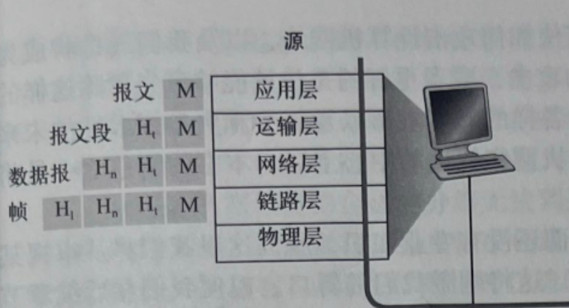
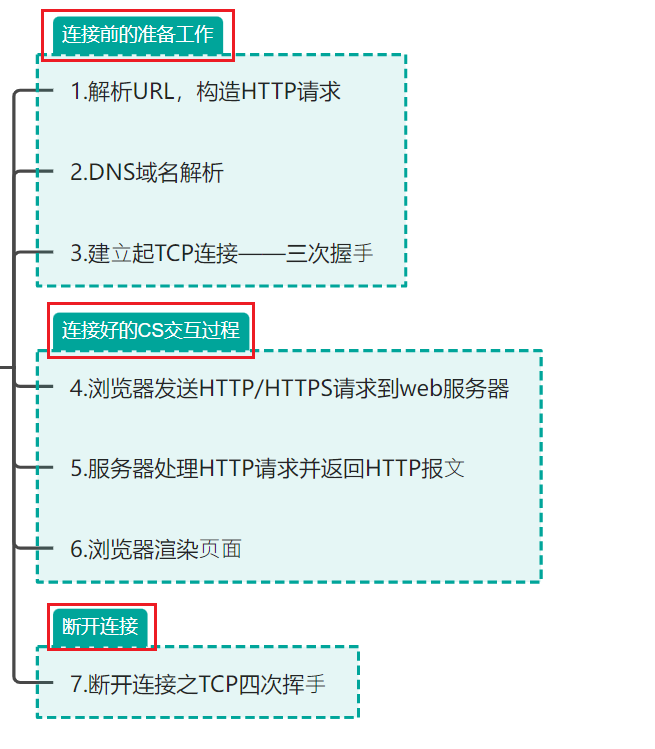
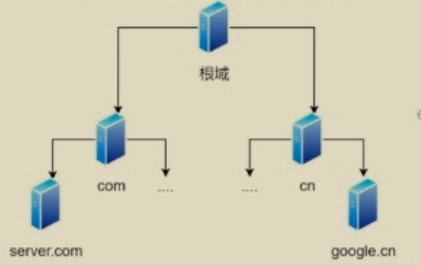
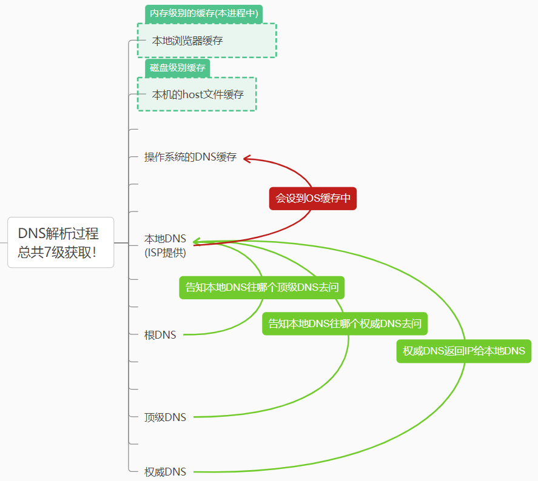

# 一、写在前面
计网知识怎么多，怎么杂，怎么牢记计算机网络的知识？按照蔡志忠记忆法，大的东西最好记，简单的东西最好入手，那么我们平时最多的就是在浏览器里面输入一个URL，立马就能跳转，用这个场景为中心点向四周展开记忆，是最佳的！

# 二、前置知识
# 精妙比喻：
从北京到上海，的一系列流程，指路人！
# 全局图

从这里我们看到，其实每一个网络设备都是具有一个**适配自身的完整的协议栈**的，**主机有5层，交换机有2层，路由器有3层**，并且每一个网络设备之间的联系，一定是**物理层面**的联系(软件是计算机里面最失败的发明，也是最伟大的)，因为最后一定会是物理层之间的传输，所以，只要既有输入又有输出的设备，在网络协议栈中的路径一定是一个拱桥形式的回路！

# 主机的协议栈
分层委托与调用！
## 上部分
### 应用层
 数据的实际产生
 应⽤程序（浏览器）通过**调⽤ Socket 库**，来委托协议栈⼯作的。
### 传输层
## 综述：
 TCP/UDP它们俩会接受应⽤层的委托执⾏收发数据的操作。并可以使得多个端口服用一个TCP连接，将一个TCP连接的数据分发给多个端口，这叫**TCP的合成与复用技术**！
## 作用：
## 1建立可靠的连接
1.1重传机制 
1.2滑动窗口 
1.3流量控制
1.4拥塞控制

---
## 下部分
### 网络层
## 综述
  协议栈的下⾯⼀半是⽤ IP 协议一下的，控制⽹络包进行收发操作，在互联⽹上传数据时，数据会被**切分成⼀块块的⽹络包**，⽽将⽹络包发送给对⽅的操作就是由 IP 负责的。 此外 IP 中还包括 **ICMP 协议**和 **ARP 协议**。
  ICMP
   ICMP ⽤于告知⽹络包传送过程中产⽣的错误以及各种控制信息(典型的ping命令)
  ARP
   ARP ⽤于根据 IP 地址查询相应的下一跳的以太⽹ MAC 地址
## 作用：
### 1.指明远程的IP定位！
### 2.同时分类局域网或者广域网=>

## 一、确定是本地局域网主机
1.主机将两个 IP 地址分别与子网掩码进行逻辑与运算后，得到的结果一致，说明是局域网下的设备，不会跳转到默认网关，就在局域网里面转发

2.获取MAC地址
如果主机里面的ARP缓存里面有对方的MAC地址，那么直接发送，如果没有，还要进行ARP广播

3.ARP广播
主机将发送ARP包广播给每一位局域网中的设备！(广播是局域网特性!)，获得了了对方的MAC地址后，便可以进行传输数据了！

4.交换机充当数据传输的中介
交换机接收到封装好的数据帧后，将从数据帧里面找到目标设备的MAC地址，从自身的MAC-端口的映射表中查到对应的端口，这样就通过端口与目标主机进行数据传输！

# 注意：交换机是必备的吗？
在某些简单场景下主机确实可以不通过交换机直接与目标主机通信，但在实际的局域网环境中，不使用交换机往往存在诸多限制，所以交换机是非常必要的
比如，如果不使用交换机，两两相连的话，将达到O(n!)de连线数！

# 原理——设计模式——迪米特模式
让所有机器链接到一个机器上，而不是所有都相连
可以把复杂度从O(n!)降低为O(n)

## 二、确定是广域网中的主机
1.主机将两个 IP 地址分别与子网掩码进行逻辑与运算后，得到的结果一致，说明是局域网下的设备，不会跳转到默认网关，就在局域网里面转发

## 前提：主机是拥有默认网关的地址的！、
## 默认网关：
负责将数据包转发到不同网络（如从局域网到广域网）的设备，比如交换机、路由器，主机通常拥有默认网关的IP地址，并且**默认网关一般是主机的广域网的第一跳**

### 链路层
  网卡驱动程序
### 物理层
  IP 下⾯的⽹卡驱动程序负责控制⽹卡硬件，⽽最下⾯的⽹卡则负责完成实际的收发操作，也就是对**⽹线中的信号**执⾏发送和接收操作。

## 链路和物理层的定位
有了IP的远程定位，我明白了最终目的地在哪里，但是下一站该去哪里呢？不仅要眺望星空，还要着眼眼前啊！——答案是通过网络设备之间的网卡进行两点传输！

### MAC作用：
MAC网卡完成这一跳到下一跳的工作

### 当前一跳的MAC网卡：发送方
当前的MAC地址是写死在网卡的ROM里面的，出厂就有的！
### 下一跳的MAC网卡：接受方
问题就转化为怎么得到下一跳的MAC网卡地址？

# 交换机的协议栈

# 路由器的协议栈

如下：

# 传输实例
例如，北京某公司员工访问位于上海的公司服务器，数据从北京办公室局域网出发，经多个路由器跨越广域网，最终到达上海服务器所在局域网并交付。 

# 三、考虑我们从浏览器中输入URL后，发生的一系列细节问题
# (一)协议栈的划分

## 从软硬件划分设备

这样来看，无论划分成多少层(其实还有OSI的7层划分，多了个表示层、会话层，只不多留给程序员自定义了！)

## 从协议栈划分设备
本质是软硬件的再次细分

# (二)实际连接流程划分
# 总的导图

# 1.连接前的准备工作

## 1.1.生成请求
输⼊ URL 后，浏览器会解析出协议、主机、端⼝、路径(https://www.baidu.com,这是逐步解析的！)等信息，并构造⼀个HTTP请求，接下来就是去往问资源

## 1.2.访问资源
### 1.2.1本地缓存
浏览器会根据请求头判断是否有 HTTP缓存 ,并根据是否有缓存决定是从服务器获取资源还是使⽤缓存资源
### 1.2.2访问服务器获取资源
缓存中没有，要访问服务器资源，第一步就是域名解析

#### 1.2.2.1域名解析
## 本质：
查询域名对应的IP地址(对应主机的唯一标识)

## 涉及d的DNS服务器：
DNS:Domain Name System

本地DNS服务器
根服务器
顶级域名DNS服务器
权威域名DNS服务器

## 过程：
一图解前言

通过这样的方式，直接可以查询到主机ip，域名解析结束！

### 建立TCP连接

## 2.连接好于服务器交互的过程
## 3.断开连接
