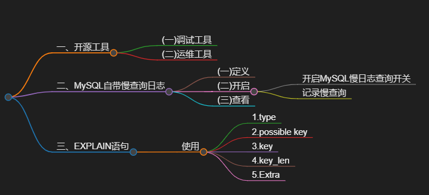
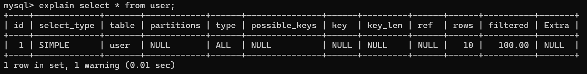

# 一、开源工具

## (一)调试工具
  Arthas
## (二)运维工具
  Prometheus

  Skywalking

----
# 二、MySQL自带慢查询日志

## (一)定义
  慢查询日志记录了所有执行时间超过指定参数(long_query_time，单位:秒，默认10秒)的所有SQL语句的日志。

## (二)开启
 如果要开启慢查询日志，需要在**MySQL的配置文件(/etc/my.cnf)**中配置如下信息:

### 开启MySQL慢日志查询开关
 slow query log=1
### 记录慢查询
 设置慢日志的时间为2秒，SQL语句执行时间超过2秒，就会视为查询，记录慢查询日志
 long query time=2
 
## (三)查看
  配置完毕之后，通过以下指令重新启动MySQL服务器进行测试，查看慢日志文件中记录的信息/var/lib/mysql/localhost-slow.log.

---
# 三、EXPLAIN语句

## 使用
  explain select *from t user where id='1’;
 与慢查询有关的栏目

### 1.type
   type 这条sql的连接的类型，性能由好到差为**NULL、system、const、eq ref、ref、range、index、all**

### 2.possible key
   当前sql可能会使用到的索引

### 3.key
   当前sql实际使用的索引

### 4.key_len
   索引占用的大小

### 5.Extra 
   额外的执行信息