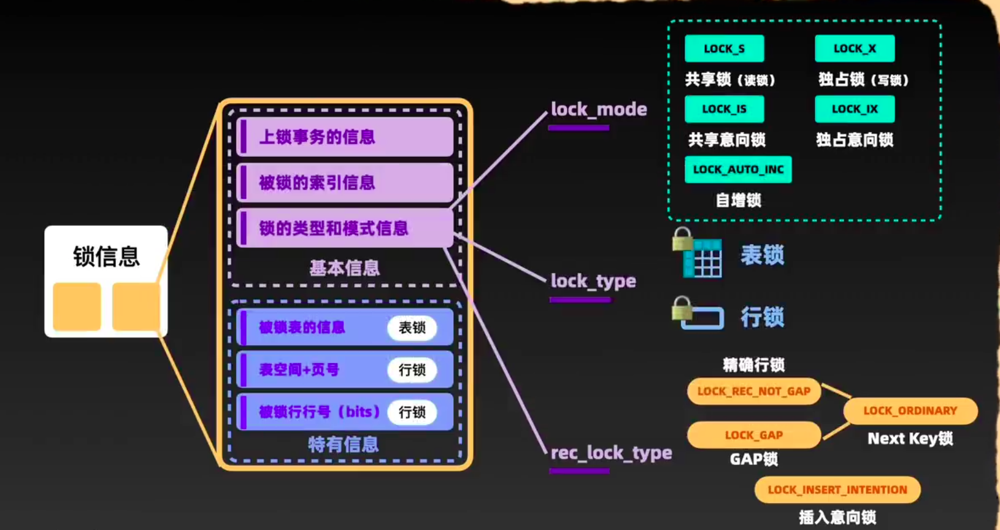
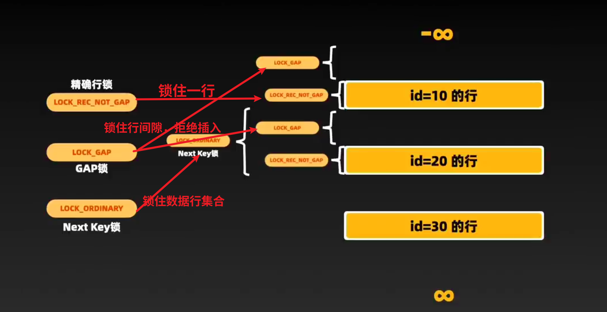

# 一、综述
每一个锁都有一个固定的数据结构，分为两部分信息：基本信息、特有信息



# 二、基本信息
1.上锁事务的信息、

2.被锁索引的信息、

3.锁的类型和模式信息

## 1.上锁事务的信息
主要包括事务的引用，标志这个锁属于那个事务

---
## 2.被锁索引的信息
就是指明了锁加载了那个索引上

---
## 3.锁的类型和模式信息
这个用一个32bit的数来表示，分为：
### 3.1 lock_mode锁模式
---
#### ①共享锁
也称为读锁，通过在sql后面加上`LOCK In Share Mode`实现,例如：
```sql
SELECT user WHERE id 10 LOCK IN SHARE MODE;
```
注意事务加上共享锁后，其他事务可以读取，但是不能添加排他锁，也不能修改数据！这样就防止了数据的修改！

---
#### ②独占锁
也称为写锁、排它锁，通过`For update`添加
```sql
对查询结果中的每行，都加「独占锁」
SELECT user WHERE id 10 FOR UPDATE;
```
事务加上这个锁后，直至释放前，其他事务将不会再加任何锁，不能读取也不能修改！

合理加`写锁、读锁`可以解决事务间的数据隔离问题，不过`有关读，可以使用效率更高的MVCC来解决`！


#### ③LOCK_IS共享意向锁

#### ④LOCK_IX独占意向锁
这两个意向锁是表的一个标识，这样其他事务`为这个表加锁`之前，就不需要遍历表中的所有数据看是不是有锁了，就只需要基于表的这个标识来判断！

---

#### ⑤LOCK_AUTO_INC自增锁
为了使用了auto_increment的主键服务的，插入数据时，生成自增锁，然后生成自增值，同时阻塞其他的插入操作，这样就能保证主键的唯一性！从而保证数据的唯一性！

注意就算事务回滚了自增值也不会回退，也就意味着自增值可能会出现不连续的情况！


---
### 3.2 lock_type锁类型

#### ①表锁
对整个表加锁，在释放之前拒接其他事务对该表的任何操作！
在特有信息中会`记录对应的表信息`

#### ②行锁
对某些行加锁，在释放之前拒接其他事务对该行的任何操作！
在特有信息中会`记录对应的行信息`以及使用一个`bit数组表示那些行被加锁`了！


### 3.3 rec_lock_type行子类型
为不同条件下选择不同的行锁而服务！
主要有四类：

#### ①精确行锁：
锁住某行，防止修改
#### ②GAP锁：
锁住行与行之间的间隙，防止插入
#### ③Next_key锁：=①+②
锁住多行数据及其之间的间隙，防止插入，同时解决一部分幻读
#### ④插入意向锁：
主要是对需要在加了某个GAP锁的数据间进行插入统计，是共享的，意味着，一旦GAP解锁，多个事务可以直接一起插入，提高效率！




---

# 三、特有信息
这里是主要记录不同锁类型的特有信息
比如表锁、行锁、被锁行行号等等！