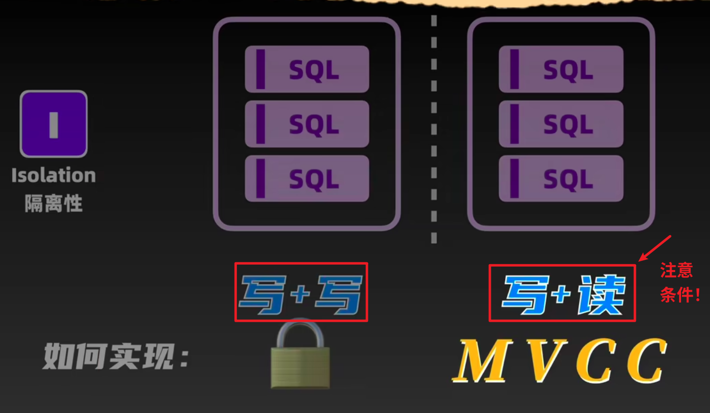
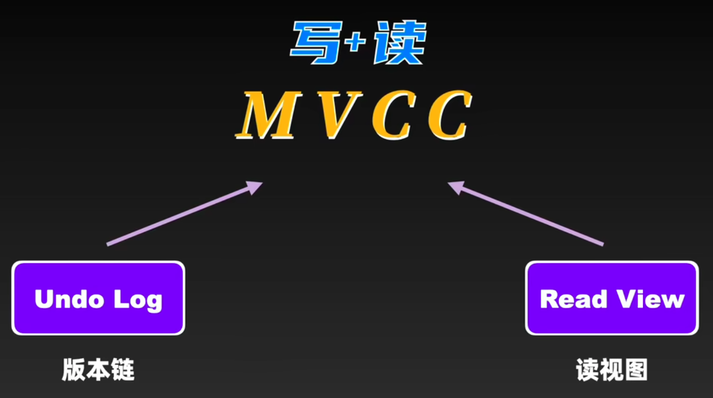
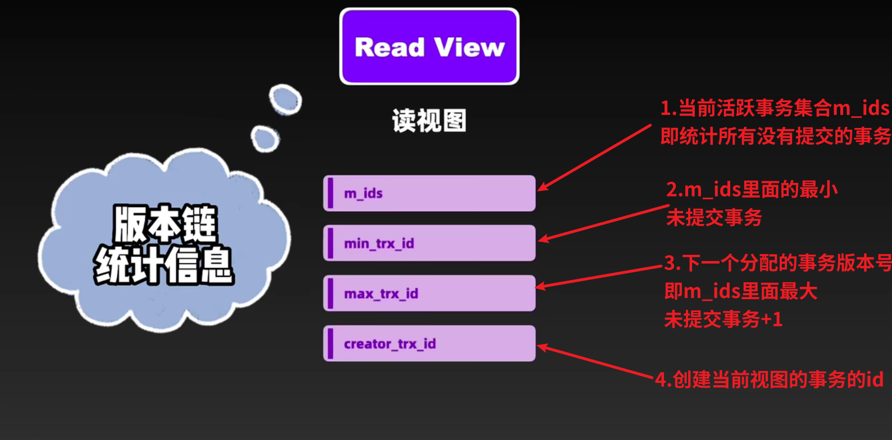
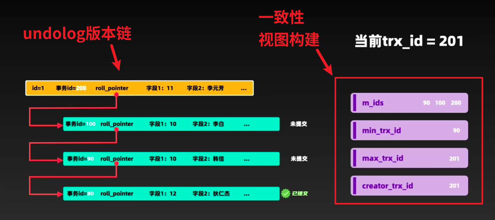
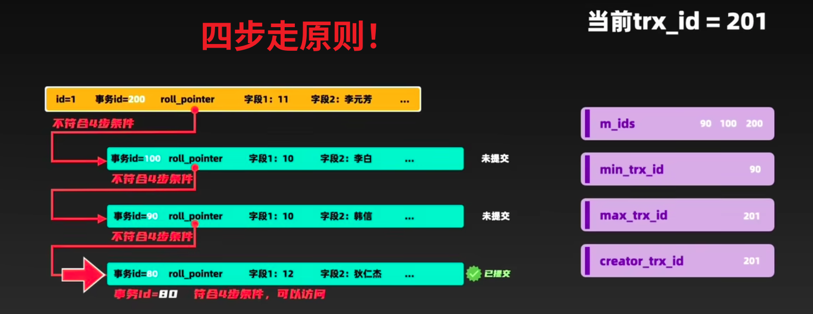

# 一、MVCC
即多版本并发控制协议
是为了解决事务的`脏读、不可重复读`等问题而诞生的！
MVCC在某些场景下代替了效率较低的锁，在`保证事务隔离的基础上，提高了事务读取的效率和并发性`！



# 二、原理：undo-log+read_view
## 1.undo-log




## 2.read_view结构


例如，这就是根据undo-log和一致性视图完成的版本链构建[注意看read_view里面的数字]



创建好read_view后，需要根据一定的规则找到唯一的可用版本——这就是`undo-log版本链和read_view的结合`来查找的！
具体来说是四部查找规则：

# 三、四步查找规则

总的来说就是遍历整个undo-log版本链条，然后如下对比：

1.来到版本链的链头，判断该版本是不是为本事务创建。如果该数据的版本号与创建视图的事务版本号相同，说明这是本事务修改的，当然可以直接访问！不等来到第二步。

2.若该数据版本的trx_id < min_trx_id，意味着该版本在read_view生成之前已经提交，当然可以直接访问！如果不是来到第三步。

3.若该版本的trx_id>max_trx_id,意味着该版本是在read_view开启之后才生成的，不可访问！则无需达到第四步，遍历并判断下一个版本。直接退出，判定为不可见。如果不是则到第四部。

4.若该版本在min_trx_id和max_trx_id之间，同时该版本`不在实物活跃列表`中，则意味着创建read_view时，该版本已经被提交，可以直接被访问！如果不是则`遍历并判断下一个版本`，直至找到唯一(也是首个)的可访问版本即可！




## 总结
所以每一个事务读到的数据的版本链都是`所有事务修改的版本链`，只不过当前事务需要找到唯一符合自己的版本的数据

伪代码实现
```java

```