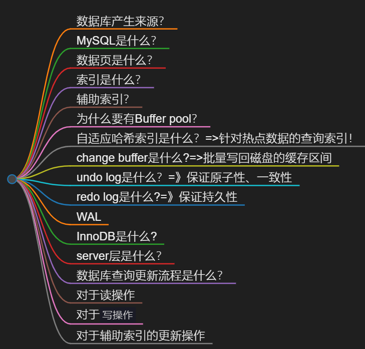
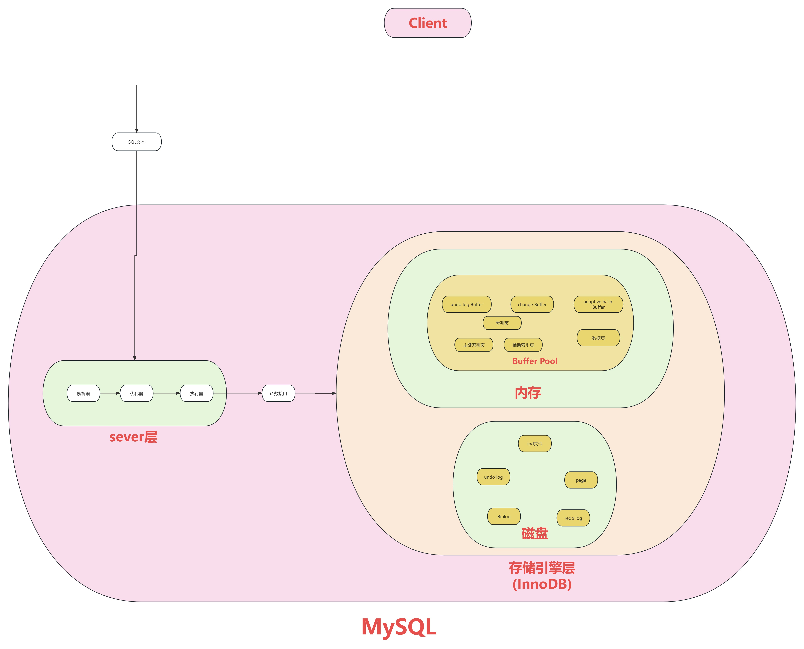

​# 整体架构

​
# 数据库产生来源？
MYSQL是什么架构是怎么样的？
你是一个程序员，你做了一个网站
应用站点里的用户数据需要存到某个地方
方便随时读写
很容易想到可以将数据存到文件里
但如果数据量很大，想**从大量文件数据中查找某部分数据并更新**，是一件很痛苦的事情
有解法吗？有——没有什么是加一层中间层不能解决的，如果有，那就再加一层
这次我们要加的中间层是MySQL

# MySQL是什么？
MYSQL数据库是一款存放和管理数据的软件
它介于`应用和数据`之间
通过一些设计
将大量数据变成一张张像excel的数据表
为应用提供创建读取更新删除等核心操作
我们来看一下它是怎么实现的

# 数据页是什么？
MYSQL将数据组织成excel表的样子，excel文件在磁盘上是个XLS文件
MYSQL的数据表也类似，在磁盘上**则是个IBD后缀的文件**
数据表越大，磁盘上的IBD文件也就越大，**直接读写一个大文件里的全部数据会很慢**
所以MYSQL将**数据拆成一个个数据页，每页大小16KB**，这样我们读写部分表数据的时候，就只需要读取磁盘里的几个数据页就好

# 索引是什么？
但数据页那么多，查某条数据时，**怎么知道要读哪些数据页好办**？
可以为每个数据页加入页号，再为每行数据加个序号，这个序号其实就是**所谓的主键**
按主键大小排序，将每个数据页里最小的主键
序号和所在页的页号提出来,放入到一个新生成的数据页中,并且给数据页加入层级的概念
这样我们就可以通过上层的数据页，快速缩小查找范围，加速查找数据页的过程
现在叶跟叶之间看起来就像是一颗倒过来的树
这棵可以加速查找数据页的树, 就是我们常说的B+树(也就是索引的一种数据结构)

# 辅助索引？
所以上面提到的是针对主键的索引,也就是主键索引,按同样的思路，也可以为其他数据表的列去建立索引，叫做辅助索引。
比如用户表的名称字段，这样我们就能快速查找到，名字为叉叉的用户有哪些
这就是所谓的**辅助索引**

# buffer pool是什么？
==>实质上还是中间层！
但就算有了索引数据，也还是在磁盘上，每次都读磁盘太慢了，有办法提升下性能吗？
有在**磁盘数据和应用之间加一层进程内缓存**，缓存里装的就是前面提到的**16KB数据和索引页**
它就是所谓的buffer pool
读数据的时候**优先读buffer pol**，有数据就返回，没数据才去磁盘里读取
减少了读磁盘的次数，大大提升了性能

# 为什么要有Buffer pool？
但问题就来了，我们知道文件读取，默认会先将文件数据加载到操作系统的文件缓存中，同样都是缓存
为什么还要整buffer pool，这死出？这是因为进程自己维护的buffer pool，可以定制更多缓存策略
还能实现加锁等各种数据表高级特性
也正是因为已经有了buffer pool

所以也就没必要使用操作系统的文件缓存了
所以Buffer pool通过直接IO模式，绕过操作系统的缓存机制
直接从磁盘读写数据，这里涉及到很多LINUX操作系统的名词

# 自适应哈希索引是什么？=>针对热点数据的查询索引！

就算有了buffer pool，要查到某个数据页也依然要查找B+树
查询复杂度O(logn)，能更快吗？能，可以使用**查询复杂度为O(1)的hash表**，进行优化
记录每个数据页的查询频率，对于热点数据，我们以查询的值为key，数据页地址为value构建哈希表。
比如内幕为小白的数据页被频繁查询
那key就是小白
value就是包含小白记录的数据页的地址
这个哈希表就是所谓的自适应哈希索引 `adaptive hash index` 

# change buffer是什么?=>批量写回磁盘的缓存区间
有了自适应哈希索引的加持,读性能提高了,那么**写性能也能优化吗**?
能————

大部分数据表除了主键索引外，我们还会加一些辅助索引！
比如对用户名加个辅助索引，那对于这类数据表的写操作，**更新完主键索引的数据页之后，还需要更新辅助索引页**
这样**读取辅助索引页的磁盘IO必然少不了**

怎么办呢？
我们可以**先将要写入的数据收集到一块内存里**
等哪天磁盘里的索引页正好被读入
buffer pool的时候，再将写入数据应用到索引页中

通过这个方式减少大量的磁盘IO提升性能，而**这个将写操作收集起来的地方就是所谓的change buffer**
它其实是buffer pool的一部分

# undo log是什么？=》保证原子性、一致性
为了实现原子性，我们就需要知道写数据时每行数据`原来`长啥样
方便对更新后的数据行进行回滚，因此就有了undo log
更新buffer pool数据页的时候,会用旧数据生成undo log记录
存储在`buffer pool`中的`特殊undo log`内存页中
并随着buffer pool的`刷盘机制`,不定时写入到磁盘的undo log文件中

# redo log是什么?=》保证持久性
上面提到的都是buffer pool相关的内容,它们`本质上都是内存`
如果内存数据只写了一半到磁盘中,数据库进程就崩了
那一个事务里的多行数据就没能做到,同时更新成功

怎么办呢? 好办
我们将事务中`更新数据行`的操作(也就是提交了就一定能找到记录)，都写入到`redo log buffer内存`中
然后在事务提交的时候`进行redo log刷磁盘`，将`数据固化到redo log文件`中
数据库进程崩溃，重启后就能通过redo log file找到历史操作记录，重做数据
保证了事务里的多行数据变更要么都成功，要么都失败

这时候问题就来了
我有这功夫更新redo log file文件,直接将buffer pool的数据写入到磁盘
不香吗?———————
不太一样
redo log file是`有顺序写入`的
buffer pool的`内存数据`是`随机分散在磁盘各处`的
顺序写磁盘性能是随机写的`几十倍`

# WAL
所以很多存储系统写数据时,都会搞个日志来记录操作
方便服务重启后进行数据对账,确保数据的一致性和完整性
这类操作就是所谓的`write ahead login(WAL)`!(中译：提前记录)

# InnoDB是什么?
我们将上面提到的内容分为`内存和磁盘`两部分
一部分是内存里的自适应hash buffer pool以及redo log buffer
另一部分是磁盘里存放行数据和索引的IBD文件,以及undo log,redo log等文件
它们共同构成了InnoDB存储引擎,并`对外提供一系列函数接口`

比如操作数据行的write row、Update row，以及操作数据表的create job等等接口
我们平时写的SQL语句，最终都会转换成InnoDB提供的这些接口的函数调用
比如insert的语句会调用write row接口，来插入数据行
create table语句会调用create接口来创建新表

# server层是什么？
但问题就来了
我们平时读写MYSQL用的SQL语句，是怎么转成存储引擎的函数接口的呢？
那就需要介绍server层了

server层本质上就是SQL语句和Innodb存储引擎之间的`中间层`
在server层内提供一个连接管理模块
用于管理来自应用的网络连接
并提供一个`分析器`,用于判断SQL语句有没有语法错误
比如select是不是少打了一个L
再提供一个`优化器`,用于根据一定的规则选择该用什么索引
生成`执行计划`之后提供一个`执行器`
根据`执行计划`去调用InnoDB存储引擎的接口函数.
`server层(SQL引擎层)和存储引擎层`,共同构成了一个完整的数据库
它就是我们常说的MYSQL数据库
并且server层和存储引擎层是通过接口函数进行解耦的
换句话说就是只要实现了上面这些接口函数，就能作为存储引擎与server层对接
比如MYSQL早期用的是`MyISAM`存储引擎
后来才支持的`InnoDB`

# binlog是什么?
你听说过删库跑路吧
为了`防止数据库被删除`带来的影响
server层会将`历史上的所有变更操作`,记录到`磁盘上的日志文件`中
这个日志文件就是所谓的binlog,一旦误删表
就可以利用binlog来恢复数据
那么问题就来了
InnoDB有一个redo log也做类似的事情,为什么还要多此一举?（很现实！！）

这个问题请点击这里查看：为什么有了redo log 还需要 binlog？-CSDN博客

# 数据库查询更新流程是什么？
接下来我们用实际例子,将上面提到的内容串起来
首先不管是`查询`还是`更新`操作,客户端都会先跟MYSQL`建立网络连接`
并将SQL发送到server层
经过分析器解析SQL,经过语法优化器选择索引生成执行计划
最终给到执行器调用InnoDB的函数接口

# 对于读操作

InnoDB存储引擎会先检查buffer pool中是否存在
所需的B+树数据页，如果存在，则直接返回数据
如果buffer pool中没有所需的数据页
则会从磁盘中读取相应的数据页
加载到buffer pool中，再返回数据
同时如果查询的数据是`热点数据`
还会将数据页`加入到自适应哈希索引`
豪华套餐中,`加速后续的查询`

# 对于`写操作`
则会先将数据写入buffer pool
并生成`相应的undo log记录`
以便在事物回滚时能够`恢复数据的原始状态`
接下来会将`写操作记录到redo log buffer`
这些redo log会`周期性`的写入到磁盘中的redo log文件中
就算数据库崩了,已提交的事物也不会丢失

# 对于辅助索引的更新操作

InnoDB会将这些更新暂时存储在change buffer中
等到相关的索引页被读取到buffer pool时
再进行实际的更新操作,从而减少磁盘IO,提高写入性能
同时所有的变更都会记录到server层的binlog中
以便进行数据恢复