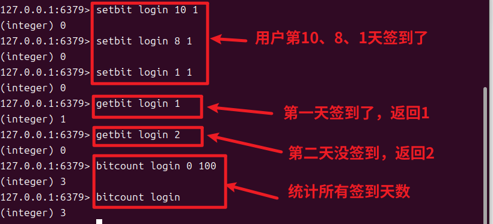

# 一、定义
Bitmaps（位图）并不是一种实际的数据类型，而是`在字符串类型上定义的一组面向位的操作`，它可以`使用极小的空间来存储大量的布尔信息`。


# 二、实用命令
1.设置指定键值的指定位为1
```redis
127.0.0.1:6379> SETBIT user_login 10 1 //将user_login键的第10位设置为1
(integer) 0
```
2.获取指定位置的位
```redis
127.0.0.1:6379> GETBIT user_login 10
(integer) 1
```

3.统计指定范围的有效布尔值
```redis
BITCOUNT key [start end]

127.0.0.1:6379> bitcount login 0 100 //0~100天的签到累计
(integer) 3

127.0.0.1:6379> bitcount login //所有签到天数
(integer) 3

```


# 三、实际使用场景
## 1.签到
可以使用位图来记录用户的签到情况，`每天对应位图中的一个位`。例如，用户在第 10 天签到，就将位图中偏移量为 9 的位设置为 1。




# 四、最长的布尔值
因为key最大能512MB，因为一个字节有8个位，所以理论最大能512MBx8=512x1024x1024x8=`4294967296`，共`42亿`！
验证：
```redis
127.0.0.1:6379> SETBIT mybitmap 4294967295 1
(integer) 1
127.0.0.1:6379> SETBIT mybitmap 4294967296 1
(error) ERR bit offset is not an integer or out of range //报错
127.0.0.1:6379> 
```