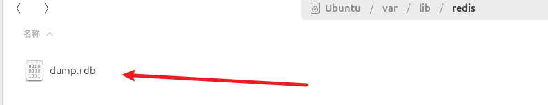

# 1.save存储二进制文件-redis database
Redis SAVE 命令用于创建当前数据库的备份。

语法
redis Save 命令基本语法如下：
```redis
redis 127.0.0.1:6379> SAVE 
OK
```

## 细节：bgsave可以在后台单开线程执行存储二进制文件的过程！

---
该命令将在 redis 安装目录中`创建dump.rdb文件`(Redis Database文件 )。（这就是大名鼎鼎的二进制文件）


# 2. 恢复数据
恢复数据
如果需要恢复数据，只需`将备份文件 (dump.rdb) 移动到 redis 安装目录`并`启动服务`即可。获取 `redis 目录可以使用 CONFIG 命令`，如下所示：

```redis
127.0.0.1:6379> CONFIG GET dir
1) "dir"
2) "/var/lib/redis"
```
