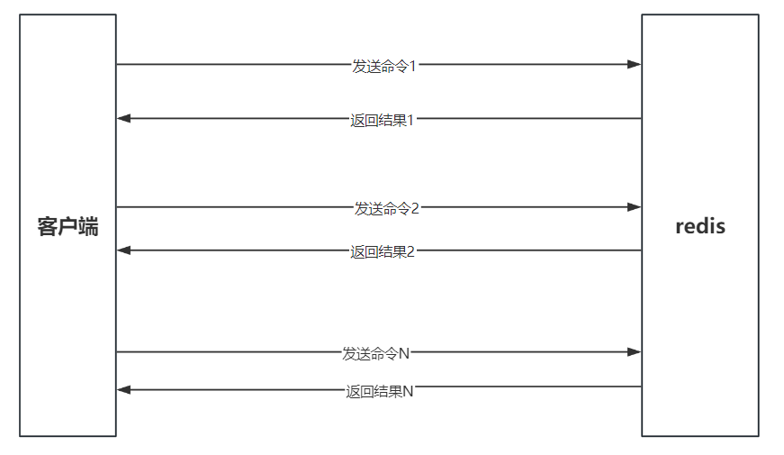

# 一、综述——一般的套接字监听
Redis是一种基于`客户端-服务端模型`以及`请求/响应协议的TCP服务`。这意味着通常情况下一个请求会遵循以下步骤：

客户端向服务端发送一个查询请求，并`监听Socket返回`，通常是`以阻塞模式`，`等待服务端响应`。
服务端处理命令，并将结果返回给客户端。

在这种模式下，`每次请求都需要经历网络传输的往返时间（RTT，Round - Trip Time）`，当需要执行大量请求时，`频繁的网络往返会严重影响性能`。


# 二、Redis 管道技术-妙喻：捡石子，每次捡一个放兜里，还是捡了一大把才放兜里的区别！
本质：管道技术的原理是`允许客户端将多个请求一次性打包发送给服务器`，服务器处理完这些请求后，再`将所有响应一次性返回给客户端`。这样就减少了客户端与服务器之间的`网络往返次数`，从而显著提高了性能。


## 实例
查看 redis 管道，只需要启动 redis 实例并输入以下命令：
```shell
$(echo -en "PING\r\n SET w3ckey redis\r\nGET w3ckey\r\nINCR visitor\r\nINCR visitor\r\nINCR visitor\r\n"; sleep 10) | nc localhost 6379
```

结果
```shell
+PONG
+OK
$5
redis
:1
:2
:3
```

以上实例中我们通过`使用 PING 命令查看redis服务是否可用`， 之后我们们设置了 w3ckey 的值为 redis，然后我们获取 w3ckey 的值并`使得 visitor 自增 3 次`。

在返回的结果中我们可以看到这些命令`一次性向 redis 服务提`交，并`最终一次性读取所有服务端的响应`


# 三、管道技术的优势
管道技术最显著的优势是`提高了 redis 服务的性能`。

示例：
